# Handbuch ioBroker.miboxer-wl433

*MiBoxer-Poolbeleuchtung (Gateway WL-433, Leuchten PW01 / PW02) lokal mit ioBroker steuern – Schritt für Schritt erklärt*

| | |
| --- | --- |
| Adapter-Version | 0.2.0 |
| Stand | 22.09.2026 |
| Voraussetzung | ioBroker mit Admin ab Version 8, js-controller ab 6.0.11, Node.js ab 22 |
| Sprache | Deutsch · [English version](Manual_miboxer-wl433.md) |

## Inhalt

1. [Über dieses Handbuch](#1-über-dieses-handbuch)
2. [Was der Adapter macht](#2-was-der-adapter-macht)
3. [Was Sie brauchen](#3-was-sie-brauchen)
4. [Schritt 1 – Leuchten und Gateway in der MiBoxer-App einrichten](#4-schritt-1--leuchten-und-gateway-in-der-miboxer-app-einrichten)
5. [Schritt 2 – Geräte-ID und Local Key besorgen](#5-schritt-2--geräte-id-und-local-key-besorgen)
6. [Schritt 3 – Adapter installieren](#6-schritt-3--adapter-installieren)
7. [Schritt 4 – Instanz einrichten](#7-schritt-4--instanz-einrichten)
8. [Schritt 5 – Prüfen, ob alles funktioniert](#8-schritt-5--prüfen-ob-alles-funktioniert)
9. [Die Poolbeleuchtung bedienen](#9-die-poolbeleuchtung-bedienen)
10. [Zonen](#10-zonen)
11. [Zeitschaltungen (Timer)](#11-zeitschaltungen-timer)
12. [Beispiele für Automatisierungen](#12-beispiele-für-automatisierungen)
13. [Fehlersuche](#13-fehlersuche)
14. [Für Neugierige: So funktioniert es im Detail](#14-für-neugierige-so-funktioniert-es-im-detail)
15. [Begriffe](#15-begriffe)
16. [Rechtliches und Kontakt](#16-rechtliches-und-kontakt)

## 1. Über dieses Handbuch

Dieses Handbuch führt Sie von der fertig eingerichteten MiBoxer-App bis zur Poolbeleuchtung, die Sie aus ioBroker heraus schalten, dimmen und färben. Sie brauchen dafür **keine Programmierkenntnisse**. Jeder Schritt ist so beschrieben, dass Sie ihn der Reihe nach abarbeiten können.

**So lesen Sie dieses Handbuch:**

- Arbeiten Sie die Kapitel 3 bis 8 **der Reihe nach** ab. Danach funktioniert die Steuerung.
- Kapitel 9 bis 12 zeigen, was Sie danach alles tun können. Kapitel 13 hilft, wenn etwas nicht klappt.
- Nummerierte Listen sind Handlungsschritte: erst Schritt 1, dann Schritt 2 und so weiter.
- Wörter in `dieser Schrift` tippen Sie genau so ab oder finden sie genau so auf dem Bildschirm.
- Unbekannte Begriffe erklärt Kapitel 15.

Farbige Kästen weisen auf Besonderes hin:

> [!TIP]
> Ein Tipp macht Ihnen die Arbeit leichter.

> [!NOTE]
> Ein Hinweis erklärt Hintergründe.

> [!IMPORTANT]
> Wichtig: Das sollten Sie auf keinen Fall übersehen.

> [!WARNING]
> Achtung: Hier kann etwas schiefgehen, wenn Sie nicht aufpassen.

**Was geprüft ist:** Alle Schritte mit dem Adapter wurden am 22.09.2026 mit einem echten WL-433-Gateway ausprobiert. Die Bilder stammen aus ioBroker Admin 8. Bei einer anderen Admin-Version können Knöpfe leicht anders aussehen oder anders heißen. Stellen, die nicht selbst ausprobiert werden konnten, sind mit **(ungeprüft)** gekennzeichnet.

## 2. Was der Adapter macht

Das MiBoxer-Gateway WL-433 ist die Brücke zwischen Ihrem Heimnetz (WLAN) und den Poolleuchten. Die Leuchten empfangen ihre Befehle per Funk (LoRa, 433 MHz) vom Gateway. Normalerweise steuern Sie das Gateway mit der MiBoxer-App – dabei läuft vieles über das Internet (die „Cloud“ des Herstellers Tuya).

Der Adapter **ioBroker.miboxer-wl433** spricht **direkt im Heimnetz** mit dem Gateway, ohne Umweg über das Internet:

```text
ioBroker  ──(Heimnetz / WLAN)──►  Gateway WL-433  ──(Funk 433 MHz)──►  Poolleuchten PW01 / PW02
```

**Das können Sie mit dem Adapter:**

- Leuchten ein- und ausschalten und dimmen (1–100 %)
- Weißes Licht von warm (2700 K) bis kalt (6500 K) einstellen
- Jede Farbe einstellen, auch blasse Pastelltöne (Farbton und Sättigung)
- Die 9 Farbprogramme M1–M9 der App starten und schneller oder langsamer laufen lassen (S+ / S-)
- Einzelne der 8 Zonen oder alle Zonen gleichzeitig steuern
- Die Leuchten mit bis zu 50 Zeitschaltungen automatisch schalten – zu festen Uhrzeiten oder nach dem Sonnenstand, auch ohne Internet
- Alles mit ioBroker-Skripten, Zeitplänen, Visualisierungen und Sprachassistenten verbinden

**Das kann der Adapter nicht (weil das Gateway es nicht meldet):**

- Er kann nicht anzeigen, welche Zone gerade welche Farbe hat. Das Gateway kennt nur **einen** Zustand für alle Leuchten: die letzte Einstellung. Auch die MiBoxer-App zeigt keinen Unterschied zwischen den Zonen.
- Er kann nicht anzeigen, wie schnell ein Farbprogramm läuft.
- Er kann nicht sehen, ob eine Leuchte den Funkbefehl wirklich empfangen hat. Er sieht nur, was das Gateway meldet.
- Er kann die Timer der MiBoxer-App weder anzeigen noch ändern – sie liegen in der Tuya-Cloud (Kapitel 11).

## 3. Was Sie brauchen

Haken Sie diese Liste ab, bevor Sie anfangen:

- [ ] Ein **MiBoxer WL-433**-Gateway und mindestens eine Leuchte **PW01** oder **PW02**, eingerichtet in der **MiBoxer-App** (Kapitel 4).
- [ ] Eine laufende **ioBroker**-Installation, zum Beispiel auf einem Raspberry Pi. Mindestversionen: **Admin 8**, **js-controller 6.0.11**, **Node.js 22**.
- [ ] Gateway und ioBroker im **selben Heimnetz**.
- [ ] Die **Geräte-ID** und den **Local Key** des Gateways (Kapitel 5). Dafür brauchen Sie einmalig ein **Android-Smartphone oder -Tablet** – ein iPhone oder iPad allein reicht dafür nicht (warum, steht in Kapitel 5).
- [ ] Etwa 30 bis 60 Minuten Zeit.

> [!TIP]
> **So prüfen Sie Ihre ioBroker-Versionen:** Öffnen Sie ioBroker Admin im Browser. Links im Menü finden Sie **Hosts** – dort stehen die Versionen von js-controller und Node.js. Unter **Adapter** zeigt die Kachel **Admin** die installierte Admin-Version.

> [!TIP]
> **Feste IP-Adresse für das Gateway:** Richten Sie in Ihrem Router eine „DHCP-Reservierung“ für das Gateway ein (bei einer FRITZ!Box: *Heimnetz → Netzwerk → Gerät bearbeiten → „Diesem Netzwerkgerät immer die gleiche IPv4-Adresse zuweisen“*). Dann ändert sich seine Adresse nie. Das ist nicht zwingend, macht den Betrieb aber zuverlässiger.

## 4. Schritt 1 – Leuchten und Gateway in der MiBoxer-App einrichten

Der Adapter übernimmt die Leuchten so, wie sie in der App eingerichtet sind. Richten Sie deshalb zuerst alles in der App ein.

1. Installieren Sie die App **MiBoxer** (Hersteller Futlight) auf Ihrem Smartphone – aus Google Play (Android) oder dem App Store (iPhone/iPad).
2. Legen Sie ein Konto an und fügen Sie das **WL-433-Gateway** hinzu. Folgen Sie dabei den Anweisungen der App.
3. Verknüpfen Sie jede Poolleuchte mit einer **Zone** des Gateways (Zone 1 bis 8). Wie das geht, beschreibt Schritt für Schritt die Anleitung [Anleitung_PW01_mit_WL-433_verbinden.pdf](Anleitung_PW01_mit_WL-433_verbinden.pdf).
4. Probieren Sie in der App aus, ob sich alle Leuchten schalten lassen.

> [!TIP]
> Notieren Sie sich, welche Leuchte in welcher Zone ist. Sie brauchen das später, wenn Sie einzelne Leuchten gezielt steuern möchten:
>
> | Zone | Leuchte (z. B. Einbauort) |
> | --- | --- |
> | 1 | |
> | 2 | |
> | 3 | |

> [!IMPORTANT]
> Wenn Sie das Gateway später aus der App löschen und neu hinzufügen („neu koppeln“), ändert sich sein **Local Key**. Dann müssen Sie Kapitel 5 wiederholen und den neuen Schlüssel im Adapter eintragen.

## 5. Schritt 2 – Geräte-ID und Local Key besorgen

Der Adapter braucht zwei Angaben, um mit dem Gateway sprechen zu dürfen:

| Angabe | Wie sie aussieht | Wofür |
| --- | --- | --- |
| **Geräte-ID** (englisch *Device ID*, im Log *devId*) | etwa 20 bis 22 Zeichen, z. B. `bf0123456789abcdefgh` | Sagt dem Adapter, *welches* Gerät gemeint ist |
| **Local Key** | genau 16 Zeichen, oft mit Sonderzeichen, z. B. `a1B2$c3D4{e5F6g7` | Das „Passwort“ für die verschlüsselte Verbindung |

Die MiBoxer-App zeigt beide Werte nirgends an. Sie schreibt sie aber in ihr internes **Protokoll** (Log) – und dieses Protokoll kann man auf einem **Android-Gerät** mitlesen.

**Der einfachste Weg ist die ausführliche Anleitung** [Anleitung_Geraete-ID_und_Local-Key_auslesen.md](Anleitung_Geraete-ID_und_Local-Key_auslesen.md) ([PDF](Anleitung_Geraete-ID_und_Local-Key_auslesen.pdf)). Sie erklärt jeden Fingertipp – ganz ohne Computer mit den Apps *LogFox* und *Shizuku*, und auch, was Sie mit einem iPhone oder iPad tun können.

### 5.1 Alternative: mit einem Computer und USB-Kabel (Windows)

Dieser Weg wurde am 22.09.2026 mit einem Android-13-Smartphone geprüft.

1. **Entwickleroptionen freischalten:** Auf dem Android-Gerät *Einstellungen → Über das Telefon* öffnen und **7-mal** auf **Build-Nummer** tippen, bis „Sie sind jetzt Entwickler“ erscheint.
2. **USB-Debugging einschalten:** *Einstellungen → System → Entwickleroptionen → USB-Debugging* einschalten. Bei Xiaomi-Geräten zusätzlich **USB-Debugging (Sicherheitseinstellungen)** einschalten.
3. **Werkzeug für den Computer laden:** Laden Sie die **SDK Platform-Tools** von Google herunter: <https://developer.android.com/tools/releases/platform-tools>. Entpacken Sie die ZIP-Datei, zum Beispiel nach `C:\sdk`.
4. **Eingabeaufforderung öffnen:** Windows-Taste drücken, `cmd` tippen, Enter drücken. Dann in den Ordner wechseln: `cd C:\sdk\platform-tools`
5. **Handy verbinden:** Das Handy per USB-Kabel anschließen und entsperren. Es fragt **„USB-Debugging zulassen?“** – Haken bei **„Von diesem Computer immer zulassen“** setzen und **OK** tippen.
6. **Verbindung prüfen:** `adb devices` eingeben. Ihr Gerät muss mit dem Wort `device` erscheinen. Steht dort `unauthorized`, haben Sie die Frage aus Schritt 5 noch nicht bestätigt: Handy entsperren und auf den Bildschirm schauen.
7. **Mitschnitt starten:** `adb logcat -v time > miboxer.txt` eingeben. Das Fenster scheint nun „hängen“ zu bleiben – das ist richtig, es schreibt mit.
8. **App benutzen:** Öffnen Sie die MiBoxer-App, tippen Sie das Gateway an und schalten Sie einmal das Licht aus und wieder ein.
9. **Mitschnitt beenden:** Zurück am Computer **Strg + C** drücken.
10. **Werte suchen:** `findstr /i "localKey devId" miboxer.txt` eingeben. In den gefundenen Zeilen stehen hinter `devId` die Geräte-ID und hinter `localKey` der Local Key.

> [!WARNING]
> Der Local Key ist wie ein Passwort. Geben Sie ihn nicht weiter und veröffentlichen Sie die Datei `miboxer.txt` nirgends. Löschen Sie die Datei, sobald Sie die Werte notiert haben. Schalten Sie danach das **USB-Debugging** in den Entwickleroptionen wieder aus.

### 5.2 Nur iPhone oder iPad vorhanden?

Apple erlaubt keinem Programm, das Protokoll anderer Apps mitzulesen. Am einfachsten leihen Sie sich für zehn Minuten ein Android-Gerät, installieren dort die MiBoxer-App und melden sich mit **Ihrem** MiBoxer-Konto an – das Gateway erscheint dann automatisch, und Sie können wie oben beschrieben vorgehen. Weitere Wege (Android-Emulator auf dem Computer) beschreibt die ausführliche Anleitung; sie sind **(ungeprüft)**.

> [!TIP]
> Die **Geräte-ID** finden Sie auch ohne Log: Nach der Installation des Adapters sucht der Knopf **Gateway im lokalen Netzwerk suchen** (Kapitel 7) alle Tuya-Geräte in Ihrem Heimnetz und zeigt ihre IDs an. Den **Local Key** kann er aber nicht herausfinden.

## 6. Schritt 3 – Adapter installieren

Der Adapter steht noch nicht in der offiziellen Adapterliste von ioBroker. Sie installieren ihn deshalb direkt von GitHub. Sobald er in die Liste aufgenommen ist, genügt es, im Reiter **Adapter** nach `miboxer` zu suchen und auf **+** (Installieren) zu klicken.

### 6.1 Expertenmodus einschalten

1. Öffnen Sie ioBroker Admin im Browser, meist unter `http://<IP-Adresse Ihres ioBroker>:8081`.
2. Klicken Sie links im Menü auf **Adapter**.
3. Klicken Sie links unten auf das **Kopf-Symbol** (rot markiert).

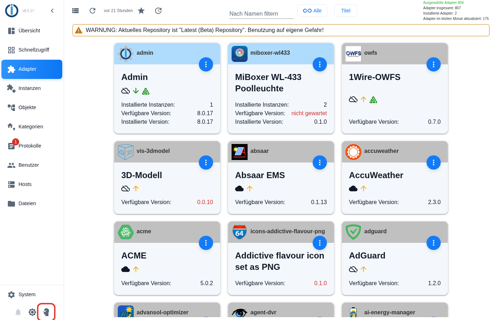

4. Es erscheint ein Hinweis zum Expertenmodus. Klicken Sie auf **Ok**.

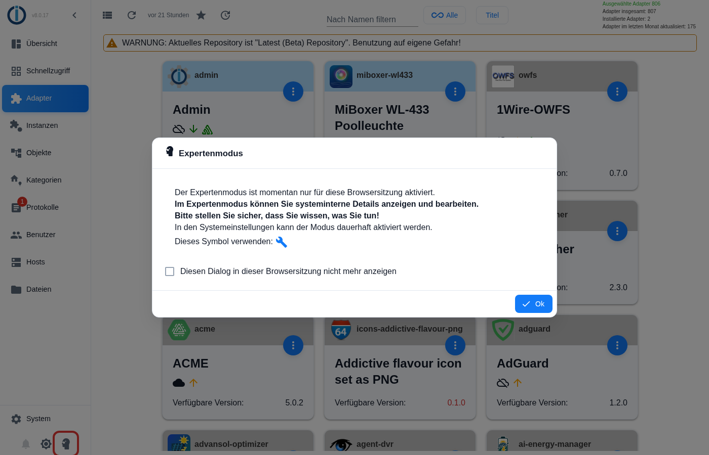

> [!NOTE]
> Der Expertenmodus zeigt zusätzliche Knöpfe. Er gilt nur für diese Browsersitzung und schadet nichts. Sie können ihn mit demselben Knopf wieder ausschalten.

### 6.2 Aus GitHub installieren

1. Oben in der Leiste erscheint jetzt ein **Katzen-Symbol** (das GitHub-Logo) mit dem Hinweis **Installieren aus eigener URL**. Klicken Sie darauf.
2. Wählen Sie im Fenster den Reiter **Benutzerdefiniert**.
3. Tragen Sie in das Feld **URL** genau diese Adresse ein: `https://github.com/ssbingo/ioBroker.miboxer-wl433`
4. Lassen Sie den Haken bei **Instanz erstellen, wenn noch keine existiert** gesetzt.
5. Klicken Sie auf **Installieren**.

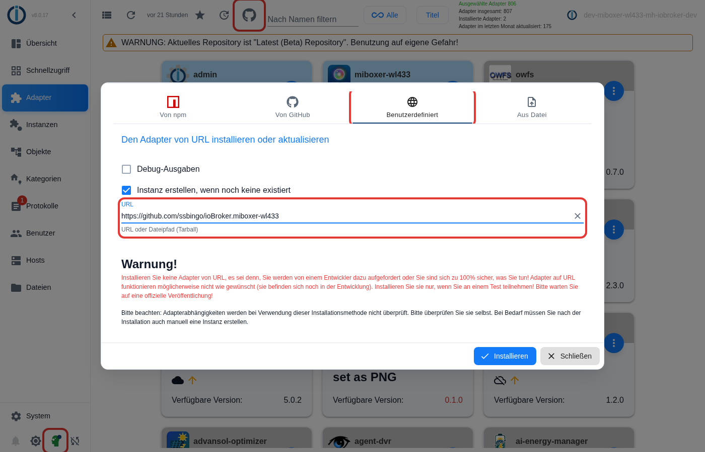

6. Ein Fenster zeigt den Fortschritt. Warten Sie, bis die Installation beendet ist (das kann auf einem Raspberry Pi einige Minuten dauern), und schließen Sie das Fenster.

> [!NOTE]
> Die rote Warnung im Fenster ist ein allgemeiner Hinweis von ioBroker für alle Adapter, die nicht aus der offiziellen Liste stammen.

**Alternative für Geübte – über die Konsole** (zum Beispiel per SSH auf dem ioBroker-Rechner):

```bash
iobroker url https://github.com/ssbingo/ioBroker.miboxer-wl433
iobroker add miboxer-wl433
```

## 7. Schritt 4 – Instanz einrichten

Nach der Installation gibt es eine **Instanz** namens `miboxer-wl433.0` – das ist der „laufende Adapter“ für Ihr Gateway.

1. Klicken Sie links auf **Instanzen**.
2. Suchen Sie die Zeile **miboxer-wl433.0** und klicken Sie auf das **Schraubenschlüssel-Symbol**. Die Einstellungsseite öffnet sich. Sie hat oben zwei Reiter: **Gateway** für die Verbindung (dieses Kapitel) und **Timer** für Zeitschaltungen (Kapitel 11). Sie beginnen im Reiter **Gateway**:

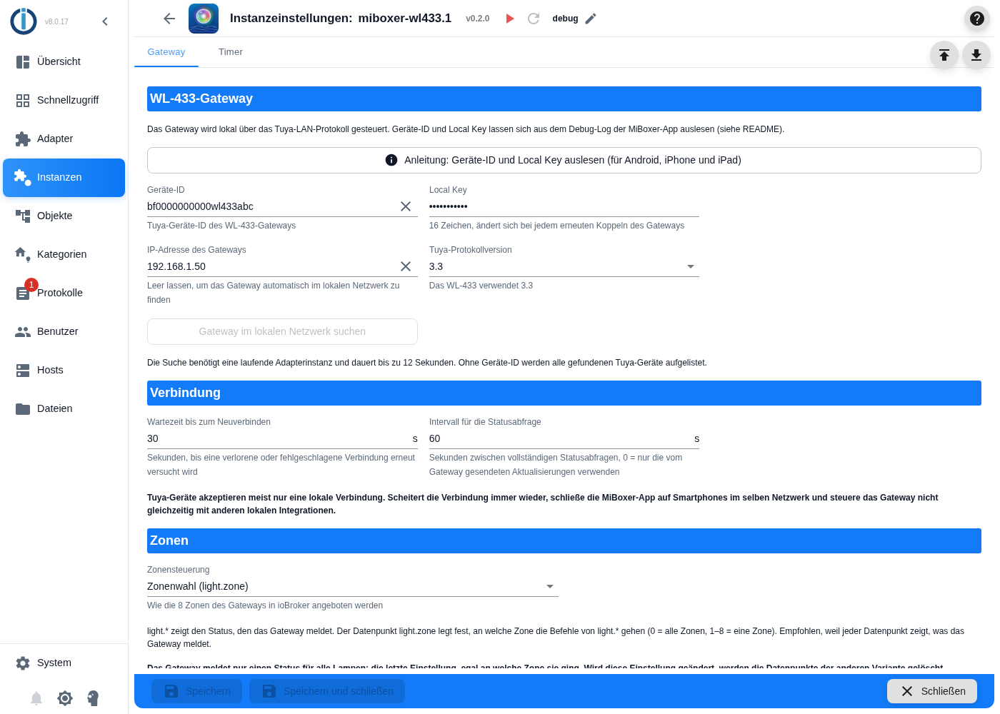

3. Füllen Sie die Felder aus:

| Feld | Was Sie eintragen | Beispiel |
| --- | --- | --- |
| **Geräte-ID** | Die Geräte-ID aus Kapitel 5 | `bf0123456789abcdefgh` |
| **Local Key** | Den Local Key aus Kapitel 5 – genau 16 Zeichen, Groß- und Kleinschreibung beachten | `a1B2$c3D4{e5F6g7` |
| **IP-Adresse des Gateways** | Die IP-Adresse des Gateways aus Ihrem Router. **Oder leer lassen** – dann sucht der Adapter das Gateway selbst | `192.168.1.50` |
| **Tuya-Protokollversion** | `3.3` stehen lassen | `3.3` |
| **Wartezeit bis zum Neuverbinden** | Nach wie vielen Sekunden der Adapter es nach einer Störung erneut versucht. `30` passt | `30` |
| **Intervall für die Statusabfrage** | Alle wie viele Sekunden der Adapter den Zustand nachfragt. `60` passt | `60` |
| **Zonensteuerung** | Wie Zonen angeboten werden – siehe unten. Im Zweifel **Zonenwahl** lassen | Zonenwahl |

4. **Zonensteuerung wählen:** Klicken Sie auf das Auswahlfeld. Es gibt zwei Möglichkeiten:

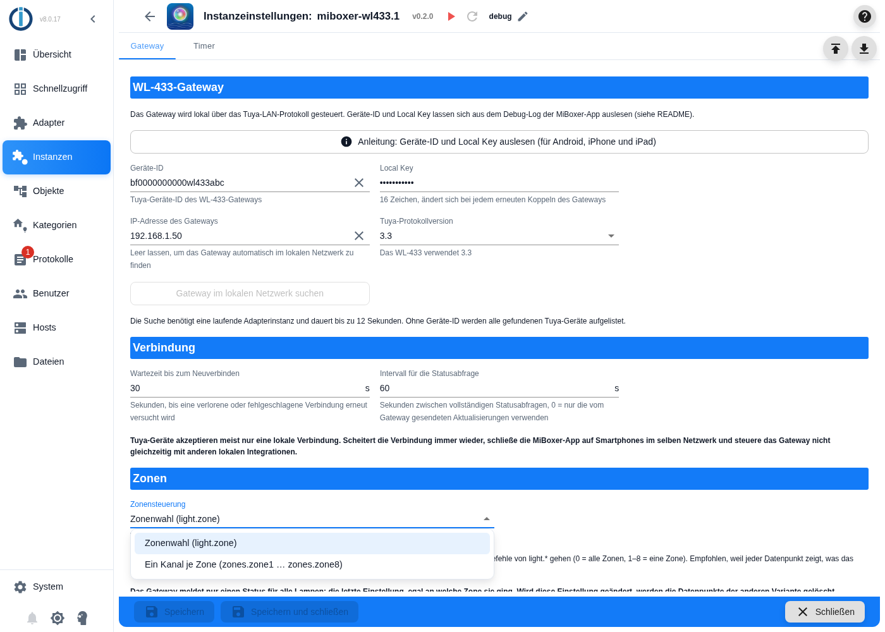

| Wahl | Was Sie bekommen | Nehmen Sie diese Wahl, wenn … |
| --- | --- | --- |
| **Zonenwahl (light.zone)** | Einen Satz Datenpunkte `light.*` und einen Datenpunkt `light.zone`, mit dem Sie festlegen, an welche Zone die Befehle gehen | … Sie alle Leuchten meist gemeinsam steuern oder unsicher sind. **Empfohlen.** |
| **Ein Kanal je Zone** | Zusätzlich die Ordner `zones.zone1` bis `zones.zone8` mit eigenen Datenpunkten je Zone | … Sie in Skripten oder Visualisierungen einzelne Zonen direkt ansprechen möchten |

Kapitel 10 erklärt beide Varianten mit Beispielen.

5. Klicken Sie unten auf **Speichern und schließen**. Die Instanz startet und verbindet sich mit dem Gateway.

> [!TIP]
> **IP-Adresse unbekannt?** Tragen Sie Geräte-ID und Local Key ein, klicken Sie auf **Speichern** (nicht schließen) und dann auf **Gateway im lokalen Netzwerk suchen**. Die Suche dauert bis zu 12 Sekunden. Findet sie das Gateway, trägt sie IP-Adresse und Protokollversion selbst ein – danach noch einmal **Speichern und schließen**. Der Knopf funktioniert nur, wenn die Instanz läuft.

> [!IMPORTANT]
> Wenn Sie die **Zonensteuerung** später ändern, löscht der Adapter die Datenpunkte der anderen Variante. Skripte, die diese Datenpunkte benutzen, müssen Sie dann anpassen.

## 8. Schritt 5 – Prüfen, ob alles funktioniert

1. **Instanz-Status:** Klicken Sie links auf **Instanzen**. Das Symbol am Anfang der Zeile **miboxer-wl433.0** zeigt den Zustand – so wie bei allen ioBroker-Adaptern:
   - **grün:** läuft und ist mit dem Gateway verbunden – alles in Ordnung;
   - **gelb:** läuft, ist aber (noch) nicht verbunden – kurz warten, sonst Kapitel 13;
   - **rot:** gestoppt – mit dem Start-Knopf (Dreieck) starten.
2. **Datenpunkte ansehen:** Klicken Sie links auf **Objekte** und öffnen Sie nacheinander die Ordner **miboxer-wl433 → 0 → light** (auf das Ordnersymbol klicken). Die Werte sollten zu dem passen, was die MiBoxer-App anzeigt:

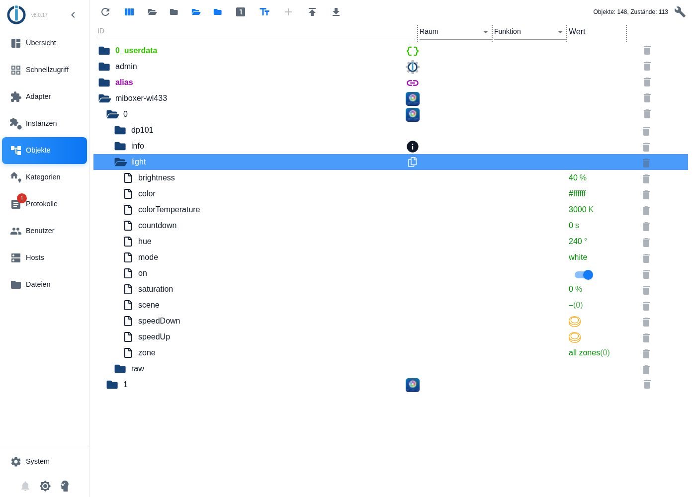

3. **Verbindung prüfen:** Im Ordner **info** muss der Datenpunkt **connection** auf `true` stehen.
4. **Erster Schalttest:** Klicken Sie in der Zeile **brightness** auf den Wert, tippen Sie `50` ein und drücken Sie Enter. Nach etwa **2 bis 3 Sekunden** zeigt auch die App 50 % Helligkeit.

> [!NOTE]
> **Warum dauert das 2 bis 3 Sekunden?** Das Gateway meldet seinen neuen Zustand erst etwa 2,5 Sekunden nach der letzten Änderung. Erst dann „bestätigt“ der Adapter den Wert. Bis dahin zeigt Admin den eingegebenen Wert als noch nicht bestätigt an.

Wenn etwas nicht klappt, lesen Sie in Kapitel 13 weiter.

## 9. Die Poolbeleuchtung bedienen

### 9.1 Einen Wert ändern

Im Reiter **Objekte** ändern Sie einen Wert so:

1. Klicken Sie in der Spalte **Wert** auf den Wert des Datenpunkts.
2. Geben Sie den neuen Wert ein oder wählen Sie ihn aus. Schalter (wie **on**) klicken Sie einfach an, Knöpfe (wie **speedUp**) ebenso.
3. Bestätigen Sie mit Enter bzw. **Übernehmen**.

In Skripten, Visualisierungen oder Sprachassistenten benutzen Sie dieselben Datenpunkte – nur eben automatisch (Kapitel 12).

### 9.2 Was möchten Sie tun?

Alle Datenpunkte liegen im Ordner `miboxer-wl433.0.light`:

| Sie möchten … | Datenpunkt | Wert (Beispiel) |
| --- | --- | --- |
| einschalten | `light.on` | `true` (Schalter an) |
| ausschalten | `light.on` | `false` (Schalter aus) – oder `light.brightness` auf `0` |
| heller oder dunkler | `light.brightness` | `1` bis `100` (Prozent) |
| warmweißes Licht | `light.colorTemperature` | `2700` |
| neutralweißes Licht | `light.colorTemperature` | `4500` |
| kaltweißes Licht | `light.colorTemperature` | `6500` |
| eine Farbe | `light.color` | `#0000ff` (blau) – oder `light.hue` mit einer Gradzahl |
| eine blassere Farbe | `light.saturation` | `0` (weiß) bis `100` (kräftig) |
| ein Farbprogramm starten | `light.scene` | `1` bis `9` (M1–M9 in der App) |
| Farbprogramm schneller | `light.speedUp` | Knopf drücken |
| Farbprogramm langsamer | `light.speedDown` | Knopf drücken |
| zurück zu weißem Licht | `light.mode` | `white` |
| zurück zur letzten Farbe | `light.mode` | `colour` |
| automatisch nach einer Zeit umschalten | `light.countdown` | Sekunden, z. B. `3600` für eine Stunde |

### 9.3 Farben

Farben stellen Sie am einfachsten über `light.color` im Format `#RRGGBB` ein oder über `light.hue` als Winkel auf dem Farbkreis:

| Farbe | `light.hue` | `light.color` |
| --- | --- | --- |
| Rot | `0` | `#ff0000` |
| Orange | `30` | `#ff8000` |
| Gelb | `60` | `#ffff00` |
| Grün | `120` | `#00ff00` |
| Türkis | `180` | `#00ffff` |
| Blau | `240` | `#0000ff` |
| Violett | `270` | `#8000ff` |
| Pink | `300` | `#ff00ff` |

Die **Helligkeit** stellen Sie immer getrennt mit `light.brightness` ein. Ein dunkler RGB-Wert wie `#800000` ergibt deshalb **kräftiges Rot in der aktuellen Helligkeit** – nicht ein dunkles Rot.

### 9.4 Was der Adapter automatisch erledigt

- **Einschalten bei Bedarf:** Stellen Sie Helligkeit, Farbe, Weißton oder ein Programm ein, während das Licht aus ist, schaltet der Adapter es zuerst ein – genau wie die App.
- **Moduswechsel:** Eine Farbtemperatur schaltet automatisch auf weißes Licht, eine Farbe auf Farblicht.
- **Schieberegler:** Ändern Sie einen Wert sehr schnell hintereinander (etwa mit einem Schieberegler), sendet der Adapter nur den letzten Wert.
- **Bestätigung:** Jeder Befehl gilt erst als ausgeführt, wenn das Gateway den neuen Zustand meldet (nach etwa 2,5 Sekunden). Bleibt die Meldung aus, fragt der Adapter nach und schreibt eine Warnung ins Protokoll (Kapitel 13).
- **Abgleich mit der App:** Was Sie in der MiBoxer-App ändern, erscheint auch in ioBroker. Zusätzlich fragt der Adapter den Zustand regelmäßig ab (Einstellung *Intervall für die Statusabfrage*).

### 9.5 DMX-Startadresse

Das WL-433 hat einen Eingang für **DMX512** – den Standard, mit dem Lichtpulte Bühnen- und Effektlicht steuern. Ab seiner **Startadresse** wertet das Gateway fünf DMX-Kanäle aus: Rot, Grün, Blau, Kaltweiß und Warmweiß. Das brauchen Sie nur, wenn Sie ein DMX-Lichtpult anschließen. Die MiBoxer-App stellt die Adresse im Punkt **DMX einstellen** ein (1 bis 512). Der Adapter zeigt sie im Datenpunkt `settings.dmxAddress` und kann sie auch ändern:

1. Öffnen Sie im Reiter **Objekte** den Ordner **miboxer-wl433 → 0 → settings**.
2. Klicken Sie auf den Wert von **dmxAddress**, tragen Sie eine Zahl von `1` bis `512` ein und drücken Sie Enter.
3. Das Gateway bestätigt die neue Adresse innerhalb weniger Sekunden. Bleibt die Bestätigung aus, steht eine Warnung im Protokoll (Kapitel 13).

Die Adresse gilt – wie in der App – für die gerade gewählte Zone: bei der Variante *Zonenwahl* für die Zone aus `light.zone`, bei *Ein Kanal je Zone* für alle Zonen.

> [!NOTE]
> Ändern Sie die Adresse nur, wenn Sie ein DMX-Lichtpult verwenden – sie muss zur Einstellung des Lichtpults passen. Ob je Zone ein eigener Kanalblock gilt, beschreibt der Hersteller nicht. Das Gateway meldet in seinem Zustand nur die letzten zwei Stellen der Adresse (das untere Byte). Eine Adresse über 255 zeigt der Adapter deshalb nach einem Neustart zunächst falsch an – richtig wieder, sobald die Adresse in der App oder im Adapter geändert wurde.

## 10. Zonen

Das Gateway kann bis zu **8 Zonen** getrennt steuern (Zone 1 bis 8) oder alle gemeinsam („ALL“). Welche Leuchte zu welcher Zone gehört, haben Sie in Kapitel 4 in der App festgelegt.

> [!IMPORTANT]
> Das Gateway meldet **nur einen Zustand für alle Leuchten** – den der letzten Einstellung, egal an welche Zone sie ging. Stellen Sie Zone 1 auf Rot und danach Zone 2 auf Blau, zeigt `light.*` „Blau“, obwohl die Leuchten in Zone 1 weiter rot leuchten. Das ist eine Eigenschaft des Gateways: Auch die MiBoxer-App zeigt keinen Unterschied zwischen den Zonen.

### 10.1 Variante „Zonenwahl“ (Standard)

Mit dem Datenpunkt `light.zone` legen Sie fest, wohin die Befehle von `light.*` gehen:

| `light.zone` | Befehle gehen an |
| --- | --- |
| `0` | alle Zonen |
| `1` bis `8` | nur diese Zone |

**Beispiel – nur die Leuchten in Zone 2 sollen blau leuchten:**

1. `light.zone` auf `2` stellen.
2. `light.color` auf `#0000ff` stellen.
3. Danach `light.zone` wieder auf `0` stellen, damit spätere Befehle wieder an alle Zonen gehen.

> [!TIP]
> `light.zone` bleibt eingestellt, bis Sie es ändern – auch nach einem Neustart. Stellen Sie es nach gezielten Befehlen an eine Zone am besten wieder auf `0`.

### 10.2 Variante „Ein Kanal je Zone“

Hier gibt es zusätzlich den Ordner `zones` mit je einem Unterordner `zone1` bis `zone8`. Jeder hat dieselben Datenpunkte wie `light` (on, brightness, colorTemperature, color, hue, saturation, mode, scene, speedUp, speedDown). `light.*` sendet in dieser Variante immer an **alle** Zonen.

**Beispiel – nur Zone 2 blau:** `zones.zone2.color` auf `#0000ff` stellen. Fertig.

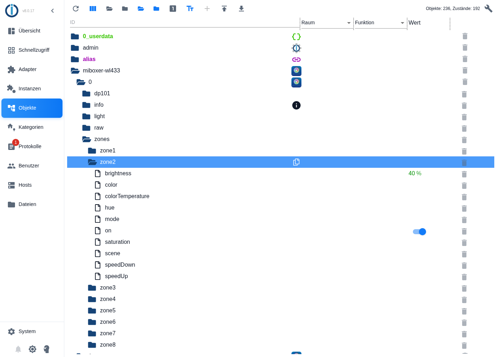

> [!NOTE]
> Ein Zonenkanal zeigt die **zuletzt an diese Zone gesendeten und vom Gateway bestätigten** Werte. Felder bleiben leer, bis Sie etwas an die Zone geschickt haben. Im Bild wurden an Zone 2 nur „Ein“ und „Helligkeit 40 %“ gesendet. Ein Befehl über `light.*` (alle Zonen) trägt seinen Wert in allen acht Zonenkanälen ein.

## 11. Zeitschaltungen (Timer)

Der Adapter kann die Poolbeleuchtung selbstständig schalten – zu festen Uhrzeiten oder passend zum Sonnenstand. Bis zu **50 Timer** richten Sie in den Einstellungen der Instanz ein, ganz ohne Programmieren. Die Timer laufen in ioBroker bei Ihnen zu Hause und funktionieren auch, wenn das Internet ausfällt.

### 11.1 Timer des Adapters oder Timer der App?

Auch die MiBoxer-App hat Timer. Beide Arten arbeiten unabhängig voneinander:

| | Timer des Adapters | Timer der MiBoxer-App |
| --- | --- | --- |
| Wo sie gespeichert sind und laufen | in ioBroker, bei Ihnen zu Hause | in der Tuya-Cloud im Internet |
| Ohne Internet | funktionieren | funktionieren nicht |
| Auslöser | feste Uhrzeit oder Sonnenereignis (z. B. Sonnenuntergang), jeweils mit Verschiebung in Minuten | feste Uhrzeit |
| Zufällige Abweichung (Anwesenheitssimulation) | ja | nein |
| Tage | Wochentage und Saison (z. B. nur 1. Mai bis 30. September) | Wochentage |
| Zonen | alle Zonen oder eine bestimmte Zone | alle Zonen |
| Aktionen | Einschalten, Ausschalten, Weißlicht, Farbe, Farbprogramm, Helligkeit und nach einer Dauer wieder ausschalten | Einschalten oder Ausschalten |

Die Angaben zu den App-Timern stammen aus einem Test mit der App am 22.09.2026.

> [!NOTE]
> Der Adapter kann die Timer der App weder anzeigen noch ändern. Schaltet ein App-Timer die Leuchten, sieht der Adapter das Ergebnis aber sofort und aktualisiert `light.*`. Sie können beide Arten gleichzeitig verwenden – achten Sie nur darauf, dass sie sich nicht widersprechen (zum Beispiel App-Timer „20:00 Uhr ein“ und Adapter-Timer „19:55 Uhr aus“).

### 11.2 Vorbereitung: Standort für Sonnenereignisse

Dieser Schritt ist nur nötig, wenn ein Timer einem Sonnenereignis folgen soll (Sonnenaufgang, Sonnenuntergang, Dämmerung …). Der Adapter berechnet diese Zeiten aus dem Standort Ihrer ioBroker-Installation. Meist ist er schon eingetragen. So prüfen Sie es:

1. Klicken Sie in ioBroker Admin links unten auf **System**. Das Fenster **Basiseinstellungen** öffnet sich.
2. Im Reiter **System** stehen rechts unter der Karte **Breitengrad** und **Längengrad** (rot markiert). Passen die Zahlen ungefähr zu Ihrem Wohnort, ist alles in Ordnung.
3. Sonst tragen Sie die Werte ein. Sie finden sie zum Beispiel, indem Sie Ihren Ort in einem Kartendienst suchen. Beispiel Berlin: Breitengrad `52.52`, Längengrad `13.40`. Verwenden Sie einen **Punkt** als Dezimaltrennzeichen.
4. Klicken Sie auf **Speichern und schließen**.
5. Starten Sie die Instanz **miboxer-wl433.0** neu (links **Instanzen**, in der Zeile auf das Symbol mit dem kreisförmigen Pfeil klicken). Erst dann übernimmt der Adapter den neuen Standort.

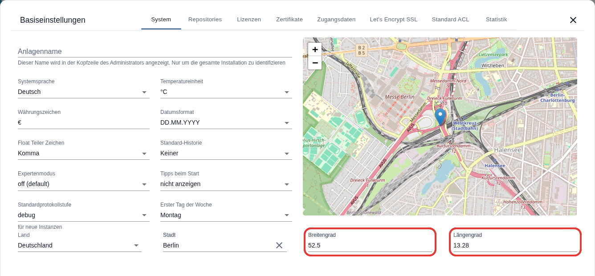

> [!NOTE]
> Fehlt der Standort, ignoriert der Adapter Timer mit Sonnenereignis und schreibt eine Warnung ins Protokoll. Timer mit fester Uhrzeit brauchen keinen Standort.

### 11.3 Einen Timer anlegen – Schritt für Schritt

1. Klicken Sie links auf **Instanzen** und in der Zeile **miboxer-wl433.0** auf das **Schraubenschlüssel-Symbol** (wie in Kapitel 7).
2. Klicken Sie oben auf den Reiter **Timer**.
3. Klicken Sie auf das **+** (Plus, rot markiert). Ein neuer Eintrag erscheint und ist gleich aufgeklappt. Er ist so vorbelegt, dass er täglich um 20:00 Uhr alle Zonen einschaltet:

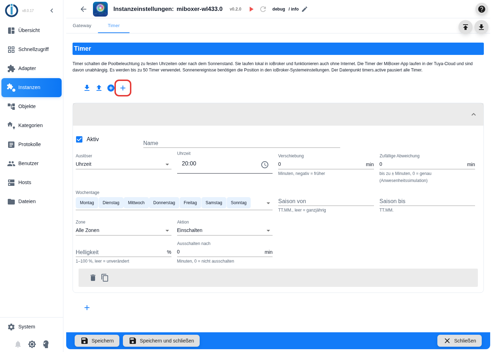

4. Tragen Sie bei **Name** eine kurze Bezeichnung ein, zum Beispiel `Pool abends`. Der Name erscheint in der Kopfzeile des Eintrags und im Protokoll.
5. Wählen Sie den **Auslöser**: *Uhrzeit* oder ein Sonnenereignis (Tabelle in 11.4). Bei *Uhrzeit* klicken Sie auf das Uhr-Symbol im Feld **Uhrzeit** und wählen die Zeit aus.
6. Wählen Sie die **Wochentage**: Klicken Sie auf das Feld, es öffnet sich eine Liste. Ein Klick auf einen Tag wählt ihn an oder ab. Ein Klick neben die Liste schließt sie wieder.
7. Legen Sie **Zone** und **Aktion** fest. Je nach Aktion erscheinen weitere Felder: **Farbtemperatur** bei *Weißlicht*, **Farbe** bei *Farbe*, **Szene** bei *Szene*.
8. Klicken Sie unten auf **Speichern und schließen**. Die Instanz startet neu und plant den Timer ein.
9. **Kontrolle:** Im Reiter **Objekte** zeigt der Datenpunkt `miboxer-wl433.0.timers.nextRun`, wann der nächste Timer schaltet (11.7).

> [!TIP]
> Legen Sie ähnliche Timer mit dem Kopieren-Symbol an (11.6) – dann müssen Sie nur noch die Unterschiede ändern.

### 11.4 Die Felder im Einzelnen

| Feld | Bedeutung | Beispiel |
| --- | --- | --- |
| **Aktiv** | Haken entfernen schaltet den Timer ab, ohne ihn zu löschen | Haken gesetzt |
| **Name** | Frei wählbare Bezeichnung | `Pool abends` |
| **Auslöser** | *Uhrzeit* oder ein Sonnenereignis (Tabelle unten) | *Sonnenuntergang* |
| **Uhrzeit** | Nur beim Auslöser *Uhrzeit*: wann der Timer schaltet | `21:30` |
| **Verschiebung** | So viele Minuten früher (negative Zahl) oder später (positive Zahl) als der Auslöser, von −720 bis 720 | `-15` = 15 Minuten vor Sonnenuntergang |
| **Zufällige Abweichung** | Der Timer schaltet jedes Mal zufällig bis zu so viele Minuten früher oder später (0 bis 120). So sieht es aus, als wäre jemand zu Hause | `10` = zwischen 10 Minuten früher und 10 Minuten später |
| **Wochentage** | An welchen Tagen der Timer schaltet | Montag bis Freitag |
| **Saison von / Saison bis** | Nur in diesem Zeitraum des Jahres, im Format `TT.MM.`. Eine Saison über den Jahreswechsel ist möglich (`01.11.` bis `28.02.`). Beide Felder leer = ganzjährig | `01.05.` bis `30.09.` |
| **Zone** | *Alle Zonen* oder eine Zone von 1 bis 8 | *Alle Zonen* |
| **Aktion** | Was passiert (Tabelle unten) | *Weißlicht* |
| **Farbtemperatur** | Nur bei *Weißlicht*: 2700 K (warm) bis 6500 K (kalt) | `3000` |
| **Farbe** | Nur bei *Farbe*: Farbe aus der Farbauswahl | Blau |
| **Szene** | Nur bei *Szene*: Farbprogramm M1 bis M9 | M3 |
| **Helligkeit** | 1 bis 100 %. Leer lassen = die Helligkeit bleibt, wie sie ist. Nicht bei *Ausschalten* | `60` |
| **Ausschalten nach** | Nach so vielen Minuten schaltet der Timer die Leuchten seiner Zone wieder aus (0 = nicht ausschalten, höchstens 1440 = 24 Stunden). Nicht bei *Ausschalten* | `120` |

**Die Sonnenereignisse:**

| Auslöser | Wann |
| --- | --- |
| *Morgendämmerung* | Es wird hell: Beginn der bürgerlichen Morgendämmerung (Sonne 6° unter dem Horizont) |
| *Sonnenaufgang* | Die Sonne erscheint am Horizont |
| *Goldene Stunde (abends)* | Beginn der „goldenen Stunde“, etwa eine Stunde vor Sonnenuntergang (Sonne 6° über dem Horizont) |
| *Sonnenuntergang* | Die Sonne verschwindet hinter dem Horizont |
| *Abenddämmerung* | Es ist fast dunkel: Ende der bürgerlichen Abenddämmerung (Sonne 6° unter dem Horizont) |
| *Nacht* | Es ist völlig dunkel: Beginn der astronomischen Nacht (Sonne 18° unter dem Horizont) |

Beispiel Berlin am 21. Juni: Morgendämmerung 03:52, Sonnenaufgang 04:43, goldene Stunde 20:37, Sonnenuntergang 21:33, Abenddämmerung 22:23 Uhr. Am 21. Dezember: Sonnenaufgang 08:14, Sonnenuntergang 15:53 Uhr.

> [!IMPORTANT]
> In Deutschland wird es von etwa Mitte Mai bis Ende Juli nie ganz dunkel – die *Nacht* findet dann nicht statt, und ein Timer mit diesem Auslöser schaltet an diesen Tagen nicht. Nehmen Sie für den Sommer besser *Abenddämmerung* mit einer Verschiebung.

**Die Aktionen:**

| Aktion | Was passiert |
| --- | --- |
| *Einschalten* | Schaltet die Leuchten mit den zuletzt eingestellten Werten ein |
| *Ausschalten* | Schaltet die Leuchten aus |
| *Weißlicht* | Weißes Licht mit der gewählten Farbtemperatur |
| *Farbe* | Die gewählte Farbe |
| *Szene* | Startet das gewählte Farbprogramm M1 bis M9 |
| *Nur Helligkeit* | Ändert nur die Helligkeit – dafür muss im Feld **Helligkeit** ein Wert stehen |

Sind die Leuchten aus, schalten *Weißlicht*, *Farbe*, *Szene* und *Nur Helligkeit* sie zuerst ein – genau wie die App.

### 11.5 Beispiele

**Beispiel 1 – im Sommer jeden Abend warmweißes Licht**

| Feld | Wert |
| --- | --- |
| Name | `Pool abends` |
| Auslöser | *Sonnenuntergang*, Verschiebung `-15` |
| Wochentage | alle |
| Saison | `01.05.` bis `30.09.` |
| Zone | *Alle Zonen* |
| Aktion | *Weißlicht*, Farbtemperatur `3000`, Helligkeit `60` |

Ergebnis: Von Mai bis September schaltet der Adapter jeden Abend 15 Minuten vor Sonnenuntergang warmweißes Licht mit 60 % Helligkeit ein.

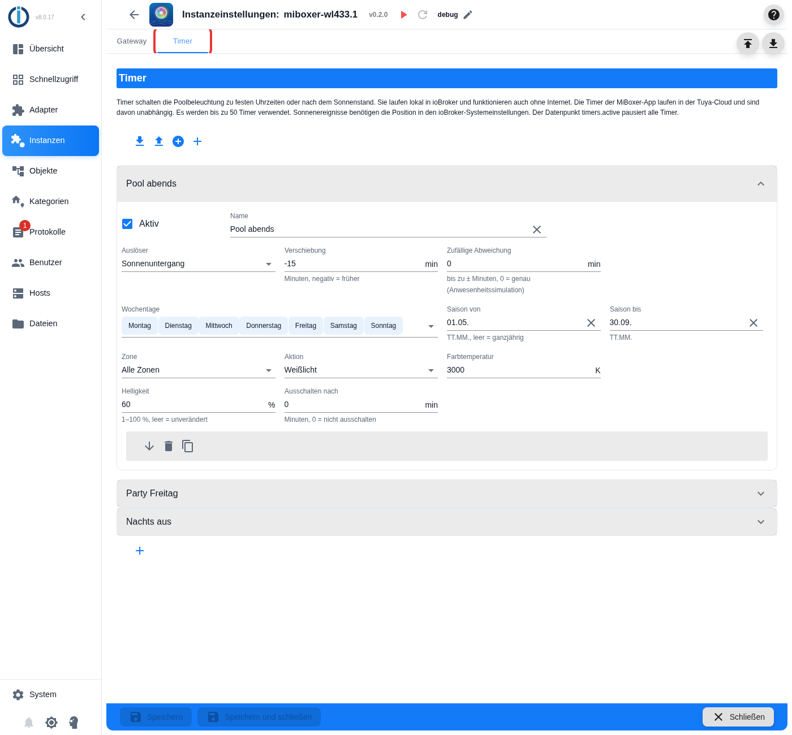

**Beispiel 2 – Farbprogramm am Wochenende für zwei Stunden**

| Feld | Wert |
| --- | --- |
| Name | `Party Freitag` |
| Auslöser | *Uhrzeit* `21:30` |
| Wochentage | Freitag, Samstag |
| Zone | *Zone 2* |
| Aktion | *Szene* M3, Ausschalten nach `120` |

Ergebnis: Freitags und samstags um 21:30 Uhr startet in Zone 2 das Farbprogramm M3. Um 23:30 Uhr schaltet der Adapter Zone 2 wieder aus.

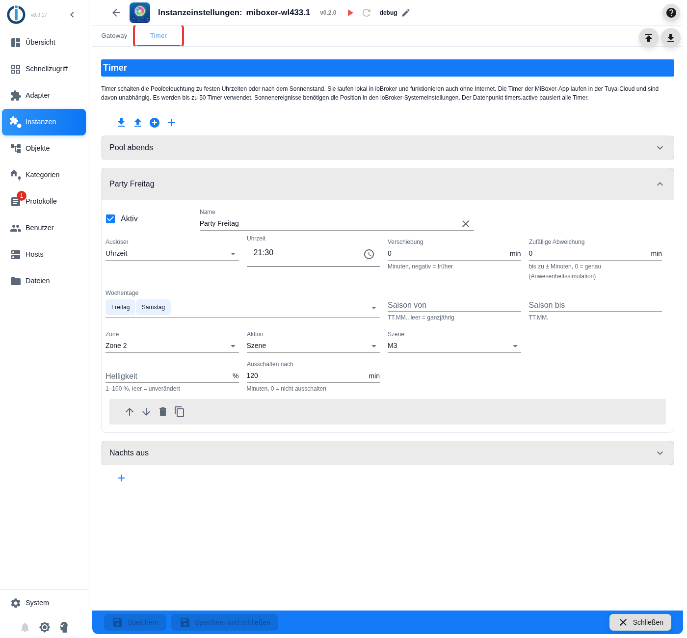

**Beispiel 3 – nachts ausschalten wie von Hand**

| Feld | Wert |
| --- | --- |
| Name | `Nachts aus` |
| Auslöser | *Uhrzeit* `23:30`, zufällige Abweichung `10` |
| Wochentage | alle |
| Zone | *Alle Zonen* |
| Aktion | *Ausschalten* |

Ergebnis: Jede Nacht gehen alle Leuchten zwischen 23:20 und 23:40 Uhr aus – jeden Tag zu einer etwas anderen Zeit.

> [!TIP]
> Beispiel 3 ist auch eine gute Absicherung: Das automatische „Ausschalten nach“ aus Beispiel 2 geht verloren, wenn die Instanz in der Zwischenzeit neu startet (11.8). Ein eigener Timer zum Ausschalten schaltet trotzdem.

### 11.6 Timer ändern, kopieren, verschieben und löschen

- **Ändern:** Klicken Sie auf die Kopfzeile eines Eintrags (den Namen), um ihn auf- oder zuzuklappen, und ändern Sie die Felder.
- In der grauen Leiste unten in jedem aufgeklappten Eintrag finden Sie diese Symbole:

| Symbol | Wirkung |
| --- | --- |
| Pfeil nach oben / nach unten | Eintrag in der Liste nach oben oder unten verschieben. Die Reihenfolge bestimmt nur die Nummer des Timers im Protokoll |
| Papierkorb | Eintrag löschen |
| Zwei Blätter | Eintrag kopieren – praktisch für ähnliche Timer |

- **Nach jeder Änderung** klicken Sie auf **Speichern und schließen**. Erst dann gelten die Änderungen. Mit **Schließen** ohne Speichern verwerfen Sie sie.
- Die Einstellungsseite lässt höchstens **50 Timer** zu.
- Über der Liste gibt es Symbole, um alle Timer in eine Datei zu sichern (**Konfigurationsabschnitt exportieren**) und sie aus einer Datei zu laden (**… importieren und ersetzen** bzw. **… importieren und hinzufügen**). So können Sie Ihre Timer sichern oder in eine andere Instanz übertragen. **(ungeprüft)**

### 11.7 Timer im Blick behalten und pausieren

Im Reiter **Objekte** finden Sie unter **miboxer-wl433 → 0 → timers** diese Datenpunkte:

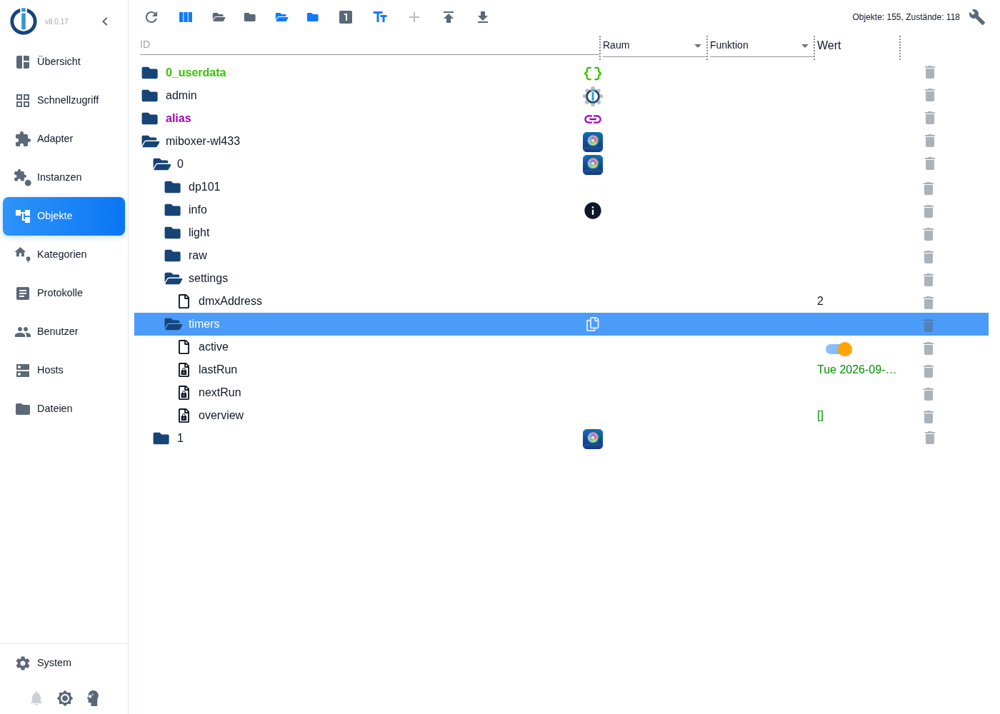

| Datenpunkt | Bedeutung |
| --- | --- |
| `timers.active` | Schalter für **alle** Timer: `false` pausiert sie (zum Beispiel im Urlaub oder im Winter), `true` lässt sie wieder laufen. Während der Pause fallende Termine werden übersprungen, nicht nachgeholt |
| `timers.nextRun` | Der nächste Lauf mit Name, zum Beispiel `Tue 2026-09-22 19:05:00 · Pool abends`. Während der Pause steht davor `paused` |
| `timers.lastRun` | Der letzte Lauf mit Name und Aktion |
| `timers.overview` | Liste aller Timer mit Zeitplan, Aktion, nächstem Lauf und – falls ein Timer ignoriert wird – dem Grund (`error`) |

Die Texte dieser Datenpunkte sind englisch: `Mon` bis `Sun` sind die Wochentage Montag bis Sonntag, `daily` bedeutet täglich.

> [!TIP]
> `timers.active` lässt sich auch aus Skripten, Visualisierungen oder Sprachassistenten schalten – Beispiel in Kapitel 12.1.

### 11.8 Gut zu wissen

- **Uhrzeit:** Es gilt die Uhrzeit des ioBroker-Rechners. Sommer- und Winterzeit werden berücksichtigt.
- **Gateway nicht verbunden:** Ist das Gateway zum Zeitpunkt eines Timers nicht erreichbar, entfällt dieser Lauf. Der Adapter schreibt eine Warnung ins Protokoll und holt den Lauf nicht nach.
- **Neustart:** Nach jedem Speichern der Einstellungen startet die Instanz neu und plant alle Timer neu. Ein laufendes „Ausschalten nach“ geht dabei verloren.
- **Wochentage und Verschiebung:** Wochentage und Saison beziehen sich auf den Tag des Auslösers. Ein Timer „Uhrzeit 00:30, Verschiebung −60, nur Samstag“ schaltet deshalb am Freitag um 23:30 Uhr.
- **Zonen:** Bei der Variante *Zonenwahl* senden Timer an ihre eigene Zone, ohne `light.zone` zu verändern. Bei *Ein Kanal je Zone* aktualisieren sie den Kanal ihrer Zone (`zones.zone1` bis `zones.zone8`).
- **Bestätigung:** Jeder Timer-Befehl wird wie jeder andere Befehl vom Gateway bestätigt (Kapitel 9.4).

### 11.9 Wenn ein Timer nicht schaltet

Gehen Sie diese Punkte der Reihe nach durch:

1. Ist beim Timer der Haken **Aktiv** gesetzt, und haben Sie **Speichern und schließen** geklickt?
2. Steht `timers.active` auf `true`?
3. Steht der Timer in `timers.overview` mit einem `error`? Dann nennt der Eintrag den Grund (englisch):

| Grund | Bedeutung | Abhilfe |
| --- | --- | --- |
| `no valid time set` | Keine Uhrzeit eingetragen | Uhrzeit wählen |
| `no weekday selected` | Kein Wochentag gewählt | Mindestens einen Tag wählen |
| `season needs "from" and "to" as DD.MM.` | Nur eines der Saisonfelder ausgefüllt oder falsches Format | Beide Felder im Format `TT.MM.` ausfüllen oder beide leeren |
| `action white needs a colour temperature` | *Weißlicht* ohne Farbtemperatur | Farbtemperatur eintragen |
| `action colour needs a colour like #0000ff` | *Farbe* ohne gültige Farbe | Farbe wählen |
| `action scene needs a scene 1 to 9` | *Szene* ohne Szene | Szene wählen |
| `action brightness needs a brightness` | *Nur Helligkeit* ohne Helligkeit | Helligkeit eintragen |
| `uses the sun event "…", but no position is set …` | Für das Sonnenereignis fehlt der Standort | Standort eintragen (11.2) |

4. Hat der Timer überhaupt einen nächsten Lauf? Steht bei ihm `nextRun` auf `null`, passen Wochentage, Saison und Auslöser nie zusammen (zum Beispiel *Nacht* nur im Juni).
5. War das Gateway zum geplanten Zeitpunkt verbunden? Im Protokoll steht dann `[timer] … could not switch the lights …`.
6. Stellen Sie die Protokollstufe auf `debug` (Kapitel 13.1). Der Adapter schreibt dann mit der Kennung `[timer]` für jeden Timer, wann er das nächste Mal läuft und warum.

## 12. Beispiele für Automatisierungen

> [!TIP]
> Für Zeitschaltungen brauchen Sie kein Skript: Die Timer aus Kapitel 11 erledigen das einfacher. Skripte lohnen sich, wenn die Beleuchtung auf andere Dinge reagieren soll – zum Beispiel auf einen Bewegungsmelder oder die Poolabdeckung.

### 12.1 Mit Skripten (JavaScript-Adapter)

Installieren Sie dazu den Adapter **JavaScript/Blockly** (Reiter **Adapter**, Suche `javascript`). Legen Sie unter **Skripte** ein neues JavaScript an und fügen Sie ein:

```javascript
// Bei Sonnenuntergang: Poolbeleuchtung blau mit 60 % Helligkeit einschalten
schedule({ astro: "sunset" }, async () => {
    await setStateAsync("miboxer-wl433.0.light.color", "#0000ff");
    await setStateAsync("miboxer-wl433.0.light.brightness", 60);
});

// Um 23:00 Uhr ausschalten
schedule("0 23 * * *", async () => {
    await setStateAsync("miboxer-wl433.0.light.on", false);
});
```

**Nur eine Zone schalten – Variante „Zonenwahl“:**

```javascript
// Zone 2 auf Farbprogramm M3, danach wieder alle Zonen ansprechen
await setStateAsync("miboxer-wl433.0.light.zone", 2);
await setStateAsync("miboxer-wl433.0.light.scene", 3);
await setStateAsync("miboxer-wl433.0.light.zone", 0);
```

**Nur eine Zone schalten – Variante „Ein Kanal je Zone“:**

```javascript
await setStateAsync("miboxer-wl433.0.zones.zone2.scene", 3);
```

**Alle Timer pausieren, solange die Poolabdeckung geschlossen ist** (den Datenpunkt der Abdeckung passen Sie an Ihre Installation an):

```javascript
on({ id: "0_userdata.0.poolAbdeckungGeschlossen", change: "ne" }, obj => {
    setState("miboxer-wl433.0.timers.active", !obj.state.val);
});
```

### 12.2 Mit Blockly (ohne Programmieren)

Blockly ist im Adapter **JavaScript/Blockly** enthalten. Sie setzen dabei Bausteine zusammen: **(ungeprüft)**

1. Unter **Skripte** ein neues **Blockly**-Skript anlegen.
2. Aus der Gruppe **Zeitplan** einen Auslöser wählen, zum Beispiel **Astro** mit *Sonnenuntergang*.
3. Aus der Gruppe **System** den Baustein **steuere** hineinziehen, die Objekt-ID `miboxer-wl433.0.light.color` auswählen und als Wert `#0000ff` eintragen.
4. Speichern und das Skript starten.

### 12.3 Visualisierung und Sprachassistenten

Die Datenpunkte haben die in ioBroker üblichen „Rollen“ (zum Beispiel *Schalter Licht*, *Dimmer*, *Farbe RGB*, *Farbtemperatur*). Visualisierungen und Adapter für Sprachassistenten können die Poolbeleuchtung deshalb meist automatisch als Lampe erkennen. **(ungeprüft)**

## 13. Fehlersuche

### 13.1 Ausführliches Protokoll einschalten

Für die Fehlersuche schreibt der Adapter auf Wunsch jeden Schritt ins Protokoll:

1. Öffnen Sie die Einstellungen der Instanz (Kapitel 7, Schraubenschlüssel).
2. Oben neben dem Namen steht die **Protokollstufe** (zum Beispiel `info`). Klicken Sie auf den **Stift** daneben und wählen Sie `debug`.
3. Den Stift finden Sie auch im Bild in Kapitel 7 oben rechts neben *v0.2.0*.

Das Protokoll sehen Sie links unter **Protokolle**. Tippen Sie oben in das Filterfeld `miboxer`, um nur die Meldungen dieses Adapters zu sehen. Jede Meldung beginnt mit einer Kennung in eckigen Klammern, zum Beispiel `[conn]` für die Verbindung oder `[cmd]` für Befehle.

> [!TIP]
> Stellen Sie die Stufe nach der Fehlersuche wieder auf `info`. Die Stufe `debug` erzeugt sehr viele Zeilen.

### 13.2 Meldungen und was Sie tun können

| Meldung im Protokoll (Anfang) | Bedeutung | Was Sie tun können |
| --- | --- | --- |
| `[cfg] Adapter is not configured: please enter the device ID and the local key …` | Geräte-ID oder Local Key fehlen | Kapitel 7: beide Felder ausfüllen |
| `[cfg] The local key must have exactly 16 characters …` | Der Local Key ist zu kurz oder zu lang | Schlüssel genau abschreiben (16 Zeichen, keine Leerzeichen) |
| `[conn] Cannot keep a connection to the WL-433 gateway …` | Das Gateway lässt den Adapter nicht zu | IP-Adresse, Local Key und Protokollversion prüfen; MiBoxer-App auf allen Handys schließen; andere Tuya-Integrationen (ioBroker.tuya, Home Assistant) für dieses Gateway abschalten |
| `[rx] Gateway sent data that could not be decoded …` | Der Local Key ist falsch oder veraltet (Gateway neu gekoppelt) | Kapitel 5 wiederholen und den neuen Local Key eintragen |
| `[disc] Gateway … did not announce itself in the local network …` | Die automatische Suche hat das Gateway nicht gefunden | IP-Adresse aus dem Router ablesen und eintragen; Gateway und ioBroker müssen im selben Netz sein |
| `[cmd] #12 light.brightness: the gateway did not confirm …` | Das Gateway hat nach einem Befehl keinen passenden Zustand gemeldet | Ist das Gateway eingeschaltet und im WLAN? In der App prüfen, ob es erreichbar ist. Tritt es öfter auf: Problem melden (13.4) |
| `[poll] … Status query not answered …` | Das Gateway antwortet nicht auf die Zustandsabfrage | Prüfen, ob es wirklich ein WL-433 ist; Problem melden (13.4) |
| `[cmd] … not executed: a colour like "#ff8800" is expected` | Der eingegebene Wert hat das falsche Format | Farbe im Format `#RRGGBB` eingeben |
| `[cmd] … not executed: gateway is not connected` | Der Befehl kam, während keine Verbindung bestand | Warten, bis `info.connection` wieder `true` ist, und den Befehl wiederholen |
| `[dp101] Status frame … has an unknown mode …` | Das Gateway meldet einen unbekannten Zustand | Problem melden (13.4) |
| `[cfg] light.mode is created again without the mode "music" …` | Einmalige Umstellung beim Update von Version 0.0.1 | Nichts – eigene Einstellungen dieses Datenpunkts (z. B. Verlauf) ggf. neu setzen |
| `[cfg] Zone mode "…": removed …` | Nach einer Änderung der Zonensteuerung wurden die Datenpunkte der anderen Variante gelöscht | Nichts – ggf. Skripte anpassen |
| `[timer] Timer 3 "…" is ignored: …` | Der Timer ist unvollständig eingerichtet; hinter dem Doppelpunkt steht der Grund | Timer im Reiter **Timer** korrigieren (11.9) |
| `[timer] Timer … uses the sun event "…", but no position is set …` | Für Sonnenereignisse fehlt der Standort | Standort eintragen und Instanz neu starten (11.2) |
| `[timer] Timer … has no run within the next year …` | Wochentage, Saison und Auslöser passen nie zusammen | Wochentage, Saison und Auslöser prüfen (11.9) |
| `[timer] #… Timer … could not switch the lights: gateway is not connected` | Zum Zeitpunkt des Timers war das Gateway nicht verbunden; dieser Lauf entfällt | Verbindung prüfen (Kapitel 8) |
| `[timer] … timers configured, only the first 50 are used …` | Es sind mehr als 50 Timer gespeichert (zum Beispiel durch einen Import) | Überzählige Timer löschen |
| `[cmd] #… settings.dmxAddress: the gateway did not confirm the DMX start address …` | Das Gateway hat die neue DMX-Startadresse nicht bestätigt | Verbindung prüfen und den Wert erneut schreiben (9.5) |

### 13.3 Häufige Fragen

**Alle Zonen zeigen dieselbe Farbe, obwohl die Leuchten verschieden leuchten.**
Das ist richtig so: Das Gateway meldet nur einen Zustand für alle Leuchten (Kapitel 10).

**Ein Wert springt nach dem Ändern kurz zurück oder wird erst nach 2 bis 3 Sekunden übernommen.**
Das Gateway meldet seinen Zustand etwa 2,5 Sekunden nach der letzten Änderung. Erst dann übernimmt der Adapter den Wert endgültig.

**Nach dem erneuten Koppeln des Gateways in der App funktioniert nichts mehr.**
Der Local Key hat sich geändert. Lesen Sie ihn neu aus (Kapitel 5) und tragen Sie ihn ein (Kapitel 7).

**Die IP-Adresse des Gateways hat sich geändert.**
Lassen Sie das Feld **IP-Adresse des Gateways** leer – dann sucht der Adapter das Gateway selbst. Besser noch: eine DHCP-Reservierung im Router einrichten (Kapitel 3).

**Die Geschwindigkeit des Farbprogramms wird nirgends angezeigt.**
Das Gateway meldet sie nicht. `speedUp` und `speedDown` wirken trotzdem.

**Der Adapter meldet Erfolg, aber eine Leuchte reagiert nicht.**
Der Adapter sieht nur das Gateway, nicht die Leuchten. Prüfen Sie, ob die Leuchte mit einer Zone verknüpft ist und ob sie in der App reagiert. Leuchten im Wasser haben eine kürzere Funkreichweite.

**Ich habe in der MiBoxer-App Timer angelegt. Warum sieht der Adapter sie nicht?**
Die Timer der App liegen in der Tuya-Cloud, nicht im Gateway. Der Adapter kann sie nicht lesen, sieht aber, wenn sie schalten (Kapitel 11.1).

**Ein Timer hat nicht geschaltet.**
Gehen Sie die Liste in Kapitel 11.9 durch.

**Mein Timer schaltet jeden Tag zu einer anderen Uhrzeit.**
Das ist richtig, wenn er einem Sonnenereignis folgt – das verschiebt sich im Lauf des Jahres – oder wenn eine zufällige Abweichung eingestellt ist.

**Wie pausiere ich alle Timer, zum Beispiel im Urlaub?**
Setzen Sie `timers.active` auf `false`. Mit `true` laufen sie wieder (Kapitel 11.7).

### 13.4 Ein Problem melden

Öffnen Sie ein „Issue“ auf GitHub: <https://github.com/ssbingo/ioBroker.miboxer-wl433/issues>. Hilfreich sind:

1. die Adapter-Version (steht in den Instanz-Einstellungen oben, z. B. *v0.2.0*);
2. ein Protokoll in der Stufe **debug** – vom Start der Instanz bis zum Fehler (13.1);
3. der Inhalt des Datenpunkts `dp101.history` (im Objekte-Reiter unter `miboxer-wl433.0.dp101` anklicken und kopieren);
4. eine kurze Beschreibung, was Sie getan haben und was passiert ist.

> [!NOTE]
> Der Adapter schreibt den Local Key **nie** ins Protokoll – im Protokoll steht nur seine Länge. Sie können das Protokoll also bedenkenlos anhängen. Hängen Sie aber **keine** Mitschnitte der MiBoxer-App an (Kapitel 5), denn die enthalten den Schlüssel.

## 14. Für Neugierige: So funktioniert es im Detail

Dieses Kapitel ist für alle, die verstehen oder nachbauen möchten, wie der Adapter mit dem Gateway spricht. Für die Bedienung brauchen Sie es nicht.

### 14.1 Die Verbindung

Das WL-433 enthält ein WLAN-Modul der Firma Tuya. Der Adapter verbindet sich über das **Tuya-LAN-Protokoll 3.3** (TCP-Port 6668, verschlüsselt mit dem Local Key) mit dem Gateway. Die eigentlichen Licht-, Zonen- und Szenenbefehle stecken im herstellerspezifischen **Datenpunkt 101**: kurze Nachrichten („Frames“) aus 12 Bytes. Das letzte Byte ist eine Prüfsumme – die Summe der ersten 11 Bytes.

### 14.2 Die Befehle

Ein Befehl an das Gateway sieht so aus (Werte in Hexadezimalschreibweise):

```text
41 00 00 0B  cc  vv  vv vv vv  zz  80  ss
             │   │             │       └─ Prüfsumme
             │   │             └─ Zone: 00 = alle, 01–08 = Zone 1–8
             │   └─ Wert
             └─ Befehl
```

| Befehl `cc` | Bedeutung | Wert `vv` |
| --- | --- | --- |
| `01` | Farbton (schaltet auf Farbe) | 0–255 für den ganzen Farbkreis, steht in den Bytes 5 bis 8 |
| `02` | Helligkeit | 1–100 % |
| `03` | Farbtemperatur | 0–38 (2700 K + 100 K je Stufe) |
| `04` | Sättigung | 0–100 % |
| `05` | Farbprogramm | 1–9 (M1–M9) |
| `06` | Taste | `01` ein, `02` aus, `03` langsamer (S-), `04` schneller (S+), `06` weißes Licht. `05` schaltet ebenfalls aus (ein zweites Mal bleiben die Leuchten aus); was diese Taste anders macht als `02`, ist noch unbekannt – der Adapter verwendet sie nicht |

Die Abfrage `43 00 00 80 00 00 00 00 00 80 80 C3` beantwortet das Gateway mit seinem Zustand:

```text
42|44 00 00 00  mm  hh  tt  bb  ss  0B  dd  xx
                │   │   │   │   │       └─ DMX-Startadresse (unteres Byte)
                │   │   │   │   └─ Sättigung (im Weißmodus 0)
                │   │   │   └─ Helligkeit
                │   │   └─ Farbtemperatur-Stufe
                │   └─ Farbton
                └─ Modus: 00 aus, 01 Farbe, 02 Weiß, 03–0B Programm M1–M9
```

`42` meldet eine Änderung (etwa 2,5 Sekunden nach der letzten Änderung), `44` ist die Antwort auf die Abfrage.

Die DMX-Startadresse (Kapitel 9.5) hat einen eigenen Befehl:

```text
49 00 00 0B 02  aa aa  00 00  zz  80  ss
                │             │       └─ Prüfsumme
                │             └─ Zone: 00 = alle, 01–08 = Zone 1–8
                └─ DMX-Startadresse 1–512 (oberes Byte, unteres Byte)
```

Das Gateway antwortet mit `49 00 00 0B 02 01 tt bb ss aa aa xx`: `01` = übernommen, danach Farbtemperatur-Stufe, Helligkeit, Sättigung und die Adresse.

### 14.3 Die Timer der MiBoxer-App

Die App speichert ihre Timer über die Tuya-Cloud (Schnittstelle `tuya.m.timer.group.add`, Kategorie `mi-light-timer`). Ein Timer besteht aus einer Uhrzeit, den Wochentagen (`loops`, zum Beispiel `0111000` = Montag bis Mittwoch, beginnend mit Sonntag) und einem Befehl wie `{"dps":{"20":true}}`. Er schreibt also den Standard-Datenpunkt 20 (ein/aus), ohne Zone und ohne Datenpunkt 101. Zur geplanten Zeit schickt die Cloud den Befehl an das Gateway; der Adapter sieht dann Datenpunkt 20 und etwa 2,5 Sekunden später den neuen Status. Lokal lassen sich diese Timer nicht auslesen.

### 14.4 Das Protokoll selbst nachvollziehen

Das Format wurde am 22.09.2026 so entschlüsselt – Sie können es mit derselben Methode nachprüfen oder für eine neuere Gateway-Firmware erweitern:

1. **Befehle der App mitlesen:** Verbinden Sie ein Android-Gerät wie in Kapitel 5.1 mit dem Computer und starten Sie `adb logcat -v time > befehle.txt`. Die MiBoxer-App schreibt jeden Befehl als Zeile `ayxsendData =<Hex-Werte>` ins Protokoll.
2. **Genau eine Aktion pro Schritt:** Führen Sie in der App genau **eine** Aktion aus (zum Beispiel „Helligkeit auf 50 %“), notieren Sie die Uhrzeit und warten Sie etwa 10 Sekunden bis zur nächsten Aktion.
3. **Befehle finden:** `findstr "ayxsendData" befehle.txt` (Windows) bzw. `grep ayxsendData befehle.txt` (Linux, macOS) listet alle gesendeten Befehle.
4. **Zustände vergleichen:** Der Datenpunkt `dp101.history` des Adapters zeigt dazu die Zustandsmeldungen des Gateways mit Uhrzeit.
5. **Selbst senden:** In `dp101.hex` können Sie 11 Bytes eintragen – der Adapter ergänzt die Prüfsumme und sendet den Frame. Beispiel: `43 00 00 80 00 00 00 00 00 80 80` fragt den Zustand ab.

> [!WARNING]
> Die Datei `befehle.txt` enthält auch den Local Key. Veröffentlichen Sie sie nicht, sondern nur die herausgesuchten `ayxsendData`-Zeilen.

Die vollständige Herleitung mit allen Belegen steht in der Protokollanalyse, Kapitel 3.1.8 und 3.1.9: [Miboxer_WL-433_PW01_Protokollanalyse_lokale_Steuerung.md](Miboxer_WL-433_PW01_Protokollanalyse_lokale_Steuerung.md).

## 15. Begriffe

| Begriff | Erklärung |
| --- | --- |
| **Adapter** | Ein Zusatzprogramm für ioBroker, das ein bestimmtes Gerät oder einen Dienst anbindet |
| **Instanz** | Ein laufender Adapter mit eigenen Einstellungen, z. B. `miboxer-wl433.0` |
| **Datenpunkt / State** | Ein einzelner Wert in ioBroker, z. B. `light.brightness`. Im Reiter **Objekte** zu sehen |
| **Bestätigt (ack)** | Der Wert wurde vom Gerät gemeldet oder bestätigt – nicht nur eingegeben |
| **Gateway** | Das Gerät WL-433, das zwischen WLAN und Funk vermittelt |
| **Zone** | Eine Gruppe von Leuchten, die gemeinsam geschaltet wird (1 bis 8) |
| **Szene / Farbprogramm** | Die Programme M1–M9 der App mit wechselnden Farben |
| **Geräte-ID** | Die eindeutige Kennung des Gateways bei Tuya |
| **Local Key** | Der geheime 16-stellige Schlüssel für die verschlüsselte Verbindung im Heimnetz |
| **Tuya** | Hersteller des WLAN-Moduls im Gateway und der zugehörigen Cloud |
| **LoRa** | Die Funktechnik, mit der das Gateway die Leuchten erreicht (433 MHz) |
| **Protokoll / Log** | Ein Tagebuch, in das ein Programm schreibt, was es tut |
| **adb** | Ein Werkzeug von Google, mit dem ein Computer auf ein Android-Gerät zugreifen kann |
| **DHCP-Reservierung** | Eine Einstellung im Router, die einem Gerät immer dieselbe IP-Adresse gibt |
| **Timer** | Eine Zeitschaltung: schaltet die Leuchten zu einer bestimmten Zeit |
| **Sonnenereignis** | Ein Zeitpunkt, der vom Sonnenstand abhängt, zum Beispiel Sonnenuntergang. Er verschiebt sich im Lauf des Jahres |
| **Dämmerung** | Die Zeit zwischen Tag und Nacht, in der es noch (abends) oder schon (morgens) etwas hell ist |
| **Saison** | Ein Zeitraum im Jahr, zum Beispiel 1. Mai bis 30. September |
| **Anwesenheitssimulation** | Licht, das jeden Tag zu leicht unterschiedlichen Zeiten schaltet, damit das Haus bewohnt wirkt |
| **DMX** | Ein Standard zur Steuerung von Bühnen- und Effektlicht über Kabel. Jedes Gerät liest ab seiner Startadresse (1 bis 512) eine feste Zahl von Kanälen |
| **JSON** | Ein Textformat für strukturierte Daten, zum Beispiel in `timers.overview` |

## 16. Rechtliches und Kontakt

Dies ist ein **inoffizielles Community-Projekt**. Es steht in keiner Verbindung zur Shenzhen Futlight Optoelectronics Co., Ltd. (MiBoxer / Mi-Light) oder zu Tuya. „MiBoxer“, „Mi-Light“ und „Tuya“ sind Marken ihrer jeweiligen Inhaber und werden nur zur Beschreibung der Kompatibilität verwendet. Die Nutzung erfolgt auf eigene Gefahr.

- Quellcode und Fragen: <https://github.com/ssbingo/ioBroker.miboxer-wl433>
- Lizenz: MIT – Copyright (c) 2026 ssbingo
