# User manual ioBroker.miboxer-wl433

*Control MiBoxer pool lights (gateway WL-433, lamps PW01 / PW02) locally with ioBroker – explained step by step*

| | |
| --- | --- |
| Adapter version | 0.2.0 |
| Date | 2026-09-22 |
| Requirements | ioBroker with Admin 8 or newer, js-controller 6.0.11 or newer, Node.js 22 or newer |
| Language | English · [Deutsche Fassung](Handbuch_miboxer-wl433.md) |

## Contents

1. [About this manual](#1-about-this-manual)
2. [What the adapter does](#2-what-the-adapter-does)
3. [What you need](#3-what-you-need)
4. [Step 1 – Set up the lamps and the gateway in the MiBoxer app](#4-step-1--set-up-the-lamps-and-the-gateway-in-the-miboxer-app)
5. [Step 2 – Get the device ID and the local key](#5-step-2--get-the-device-id-and-the-local-key)
6. [Step 3 – Install the adapter](#6-step-3--install-the-adapter)
7. [Step 4 – Set up the instance](#7-step-4--set-up-the-instance)
8. [Step 5 – Check that everything works](#8-step-5--check-that-everything-works)
9. [Operating the pool lights](#9-operating-the-pool-lights)
10. [Zones](#10-zones)
11. [Timers](#11-timers)
12. [Automation examples](#12-automation-examples)
13. [Troubleshooting](#13-troubleshooting)
14. [For the curious: how it works in detail](#14-for-the-curious-how-it-works-in-detail)
15. [Glossary](#15-glossary)
16. [Legal notice and contact](#16-legal-notice-and-contact)

## 1. About this manual

This manual takes you from a MiBoxer app that is already set up to pool lights you switch, dim and colour from ioBroker. You **do not need any programming knowledge**. Every step is described so that you can simply work through it in order.

**How to read this manual:**

- Work through chapters 3 to 8 **in order**. After that, the control works.
- Chapters 9 to 12 show what you can do afterwards. Chapter 13 helps when something does not work.
- Numbered lists are steps to carry out: first step 1, then step 2 and so on.
- Words in `this font` are typed exactly like that or appear exactly like that on the screen.
- Chapter 15 explains unfamiliar terms.

Coloured boxes point out something special:

> [!TIP]
> A tip makes your work easier.

> [!NOTE]
> A note explains the background.

> [!IMPORTANT]
> Important: do not overlook this.

> [!WARNING]
> Caution: something can go wrong here if you are not careful.

**What has been checked:** all steps with the adapter were tried out on 2026-09-22 with a real WL-433 gateway. The pictures come from ioBroker Admin 8. With another Admin version, buttons may look slightly different or have other names. Places that could not be tried out are marked **(unverified)**.

## 2. What the adapter does

The MiBoxer WL-433 gateway is the bridge between your home network (WiFi) and the pool lights. The lamps receive their commands by radio (LoRa, 433 MHz) from the gateway. Normally you control the gateway with the MiBoxer app – a lot of it goes through the internet (the "cloud" of the manufacturer Tuya).

The adapter **ioBroker.miboxer-wl433** talks to the gateway **directly in your home network**, without a detour through the internet:

```text
ioBroker  ──(home network / WiFi)──►  WL-433 gateway  ──(radio 433 MHz)──►  PW01 / PW02 pool lights
```

**What you can do with the adapter:**

- Switch the lamps on and off and dim them (1–100 %)
- Set white light from warm (2700 K) to cold (6500 K)
- Set any colour, including pale pastel shades (hue and saturation)
- Start the 9 colour programmes M1–M9 of the app and make them run faster or slower (S+ / S-)
- Control single zones of the 8 zones or all zones at once
- Switch the lamps automatically with up to 50 timers – at fixed times or with the sun, also without internet
- Connect everything with ioBroker scripts, schedules, visualisations and voice assistants

**What the adapter cannot do (because the gateway does not report it):**

- It cannot show which zone currently has which colour. The gateway knows only **one** state for all lamps: the last setting. The MiBoxer app does not show a difference between the zones either.
- It cannot show how fast a colour programme runs.
- It cannot see whether a lamp really received the radio command. It only sees what the gateway reports.
- It can neither show nor change the timers of the MiBoxer app – they are stored in the Tuya cloud (chapter 11).

## 3. What you need

Tick off this list before you start:

- [ ] A **MiBoxer WL-433** gateway and at least one **PW01** or **PW02** lamp, set up in the **MiBoxer app** (chapter 4).
- [ ] A running **ioBroker** installation, for example on a Raspberry Pi. Minimum versions: **Admin 8**, **js-controller 6.0.11**, **Node.js 22**.
- [ ] Gateway and ioBroker in the **same home network**.
- [ ] The **device ID** and the **local key** of the gateway (chapter 5). For this you need an **Android phone or tablet** once – an iPhone or iPad alone is not enough (chapter 5 explains why).
- [ ] About 30 to 60 minutes of time.

> [!TIP]
> **How to check your ioBroker versions:** open ioBroker Admin in the browser. In the menu on the left you find **Hosts** – it shows the versions of js-controller and Node.js. Under **Adapters**, the **Admin** tile shows the installed Admin version.

> [!TIP]
> **Fixed IP address for the gateway:** set up a "DHCP reservation" for the gateway in your router (on a FRITZ!Box: *Home Network → Network → edit device → "Always assign this network device the same IPv4 address"*). Then its address never changes. This is not required, but it makes operation more reliable.

## 4. Step 1 – Set up the lamps and the gateway in the MiBoxer app

The adapter takes over the lamps the way they are set up in the app. So first set up everything in the app.

1. Install the **MiBoxer** app (manufacturer Futlight) on your phone – from Google Play (Android) or the App Store (iPhone/iPad).
2. Create an account and add the **WL-433 gateway**. Follow the instructions of the app.
3. Link every pool lamp to a **zone** of the gateway (zone 1 to 8). The guide [Anleitung_PW01_mit_WL-433_verbinden.pdf](Anleitung_PW01_mit_WL-433_verbinden.pdf) (German) explains this step by step.
4. Try out in the app whether all lamps can be switched.

> [!TIP]
> Write down which lamp is in which zone. You will need this later if you want to control single lamps:
>
> | Zone | Lamp (e.g. location) |
> | --- | --- |
> | 1 | |
> | 2 | |
> | 3 | |

> [!IMPORTANT]
> If you later delete the gateway from the app and add it again ("pair it again"), its **local key** changes. Then repeat chapter 5 and enter the new key in the adapter.

## 5. Step 2 – Get the device ID and the local key

The adapter needs two values to be allowed to talk to the gateway:

| Value | What it looks like | What it is for |
| --- | --- | --- |
| **Device ID** (*devId* in the log) | about 20 to 22 characters, e.g. `bf0123456789abcdefgh` | Tells the adapter *which* device is meant |
| **Local key** | exactly 16 characters, often with special characters, e.g. `a1B2$c3D4{e5F6g7` | The "password" for the encrypted connection |

The MiBoxer app does not show these values anywhere. But it writes them to its internal **log** – and this log can be read on an **Android device**.

**The easiest way is the detailed guide** [Anleitung_Geraete-ID_und_Local-Key_auslesen.md](Anleitung_Geraete-ID_und_Local-Key_auslesen.md) ([PDF](Anleitung_Geraete-ID_und_Local-Key_auslesen.pdf), German). It explains every tap – completely without a computer using the apps *LogFox* and *Shizuku*, and also what you can do with an iPhone or iPad.

### 5.1 Alternative: with a computer and a USB cable (Windows)

This way was checked on 2026-09-22 with an Android 13 phone.

1. **Unlock the developer options:** on the Android device open *Settings → About phone* and tap **Build number** **7 times** until "You are now a developer" appears.
2. **Switch on USB debugging:** switch on *Settings → System → Developer options → USB debugging*. On Xiaomi devices also switch on **USB debugging (Security settings)**.
3. **Get the tool for the computer:** download the **SDK Platform-Tools** from Google: <https://developer.android.com/tools/releases/platform-tools>. Unpack the ZIP file, for example to `C:\sdk`.
4. **Open a command prompt:** press the Windows key, type `cmd`, press Enter. Then change to the folder: `cd C:\sdk\platform-tools`
5. **Connect the phone:** connect the phone with a USB cable and unlock it. It asks **"Allow USB debugging?"** – tick **"Always allow from this computer"** and tap **OK**.
6. **Check the connection:** type `adb devices`. Your device must appear with the word `device`. If it says `unauthorized`, you have not yet confirmed the question from step 5: unlock the phone and look at the screen.
7. **Start recording:** type `adb logcat -v time > miboxer.txt`. The window now seems to "hang" – that is correct, it is recording.
8. **Use the app:** open the MiBoxer app, tap the gateway and switch the light off and on once.
9. **Stop recording:** back at the computer, press **Ctrl + C**.
10. **Search for the values:** type `findstr /i "localKey devId" miboxer.txt`. In the lines found, the device ID follows `devId` and the local key follows `localKey`.

> [!WARNING]
> The local key is like a password. Do not pass it on and do not publish the file `miboxer.txt` anywhere. Delete the file as soon as you have written down the values. Afterwards switch **USB debugging** off again in the developer options.

### 5.2 Only an iPhone or iPad available?

Apple does not allow any program to read the log of other apps. The easiest way is to borrow an Android device for ten minutes, install the MiBoxer app on it and log in with **your** MiBoxer account – the gateway then appears automatically, and you can proceed as described above. Further ways (Android emulator on the computer) are described in the detailed guide; they are **(unverified)**.

> [!TIP]
> You can also find the **device ID** without a log: after installing the adapter, the button **Search gateway in the local network** (chapter 7) searches all Tuya devices in your home network and shows their IDs. It cannot find out the **local key**, though.

## 6. Step 3 – Install the adapter

The adapter is not yet in the official adapter list of ioBroker. So you install it directly from GitHub. As soon as it has been added to the list, it is enough to search for `miboxer` on the **Adapters** tab and click **+** (install).

### 6.1 Switch on expert mode

1. Open ioBroker Admin in the browser, usually at `http://<IP address of your ioBroker>:8081`.
2. Click **Adapters** in the menu on the left.
3. Click the **head symbol** at the bottom left (marked in red).

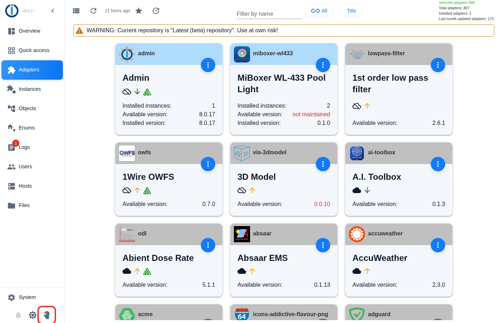

4. A note about expert mode appears. Click **Ok**.

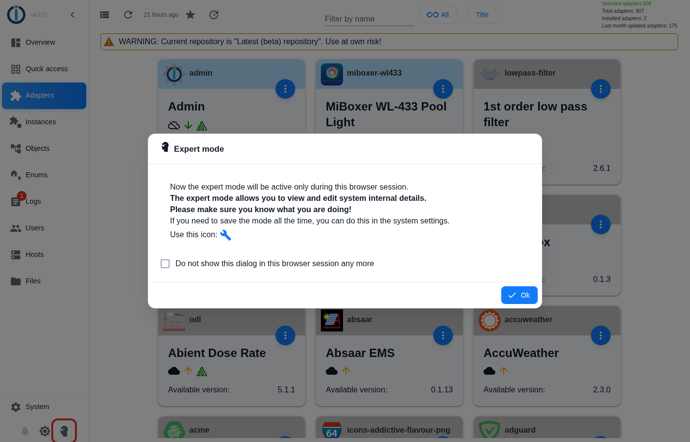

> [!NOTE]
> Expert mode shows additional buttons. It only applies to this browser session and does no harm. You can switch it off again with the same button.

### 6.2 Install from GitHub

1. A **cat symbol** (the GitHub logo) with the tooltip **Install from custom URL** now appears in the bar at the top. Click it.
2. Choose the tab **Custom** in the window.
3. Enter exactly this address in the field **URL**: `https://github.com/ssbingo/ioBroker.miboxer-wl433`
4. Keep the tick at **Create instance if it does not exist yet**.
5. Click **Install**.

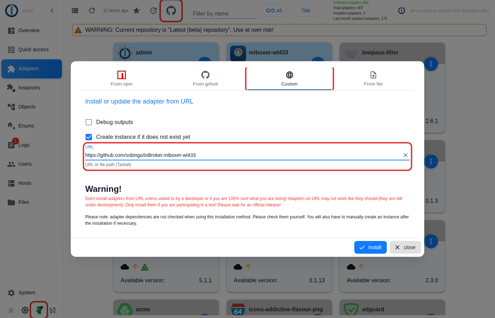

6. A window shows the progress. Wait until the installation has finished (on a Raspberry Pi this can take a few minutes) and close the window.

> [!NOTE]
> The red warning in the window is a general note of ioBroker for all adapters that do not come from the official list.

**Alternative for experienced users – on the console** (for example via SSH on the ioBroker computer):

```bash
iobroker url https://github.com/ssbingo/ioBroker.miboxer-wl433
iobroker add miboxer-wl433
```

## 7. Step 4 – Set up the instance

After the installation there is an **instance** called `miboxer-wl433.0` – this is the "running adapter" for your gateway.

1. Click **Instances** on the left.
2. Find the row **miboxer-wl433.0** and click the **spanner symbol**. The settings page opens. It has two tabs at the top: **Gateway** for the connection (this chapter) and **Timers** for switching times (chapter 11). You start on the tab **Gateway**:

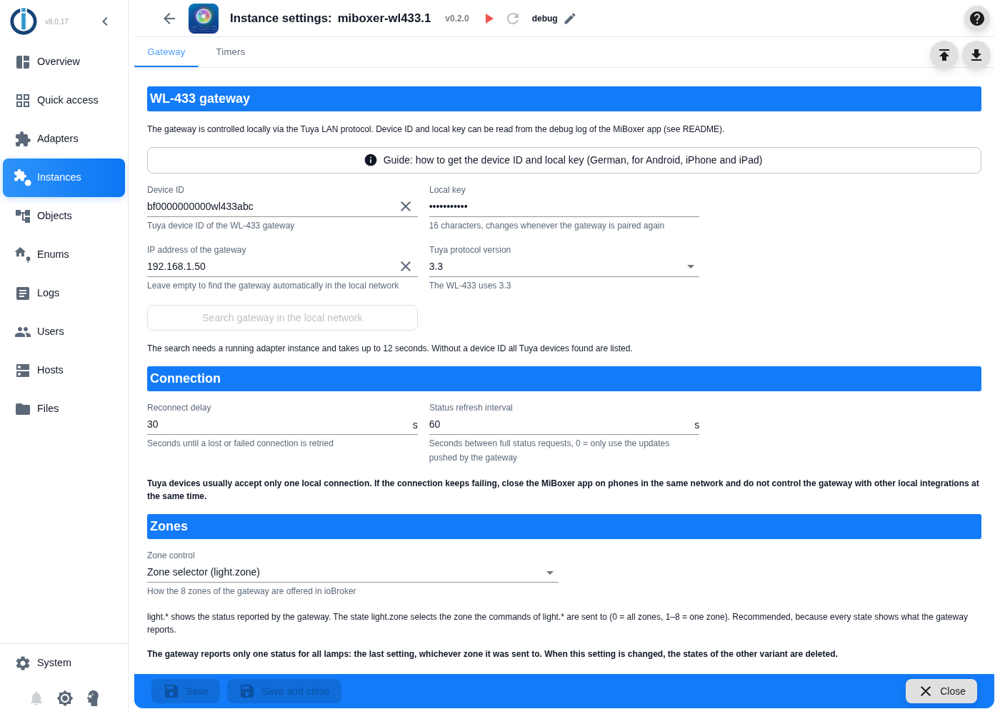

3. Fill in the fields:

| Field | What you enter | Example |
| --- | --- | --- |
| **Device ID** | The device ID from chapter 5 | `bf0123456789abcdefgh` |
| **Local key** | The local key from chapter 5 – exactly 16 characters, mind upper and lower case | `a1B2$c3D4{e5F6g7` |
| **IP address of the gateway** | The IP address of the gateway from your router. **Or leave it empty** – then the adapter searches the gateway itself | `192.168.1.50` |
| **Tuya protocol version** | Keep `3.3` | `3.3` |
| **Reconnect delay** | After how many seconds the adapter tries again after a problem. `30` is fine | `30` |
| **Status refresh interval** | Every how many seconds the adapter asks for the state. `60` is fine | `60` |
| **Zone control** | How zones are offered – see below. If in doubt, keep **Zone selector** | Zone selector |

4. **Choose the zone control:** click the selection field. There are two options:

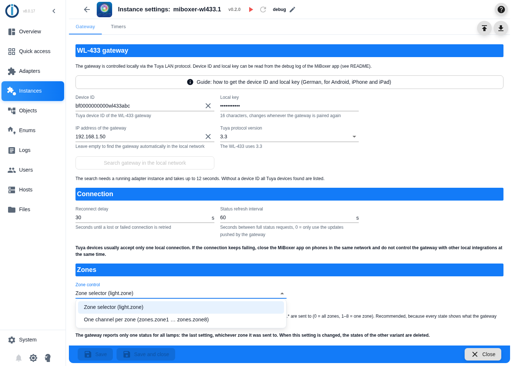

| Choice | What you get | Take this choice if … |
| --- | --- | --- |
| **Zone selector (light.zone)** | One set of states `light.*` and a state `light.zone` that selects the zone the commands go to | … you mostly control all lamps together or you are unsure. **Recommended.** |
| **One channel per zone** | In addition the folders `zones.zone1` to `zones.zone8` with their own states per zone | … you want to address single zones directly in scripts or visualisations |

Chapter 10 explains both variants with examples.

5. Click **Save and close** at the bottom. The instance starts and connects to the gateway.

> [!TIP]
> **IP address unknown?** Enter device ID and local key, click **Save** (do not close) and then **Search gateway in the local network**. The search takes up to 12 seconds. If it finds the gateway, it enters IP address and protocol version itself – afterwards click **Save and close** once more. The button only works while the instance is running.

> [!IMPORTANT]
> If you change the **zone control** later, the adapter deletes the states of the other variant. Scripts that use these states then have to be adapted.

## 8. Step 5 – Check that everything works

1. **Instance status:** click **Instances** on the left. The symbol at the beginning of the row **miboxer-wl433.0** shows the state – just as for all ioBroker adapters:
   - **green:** running and connected to the gateway – everything is fine;
   - **yellow:** running, but not (yet) connected – wait a moment, otherwise see chapter 13;
   - **red:** stopped – start it with the start button (triangle).
2. **Look at the states:** click **Objects** on the left and open the folders **miboxer-wl433 → 0 → light** one after the other (click the folder symbol). The values should match what the MiBoxer app shows:

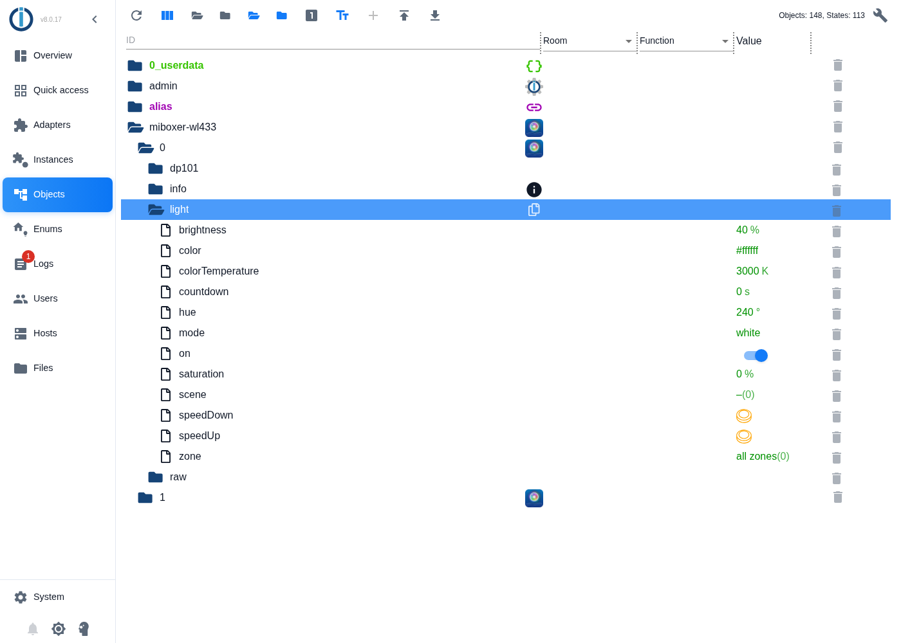

3. **Check the connection:** in the folder **info**, the state **connection** must be `true`.
4. **First switching test:** click the value in the row **brightness**, type `50` and press Enter. After about **2 to 3 seconds** the app also shows 50 % brightness.

> [!NOTE]
> **Why does it take 2 to 3 seconds?** The gateway reports its new state only about 2.5 seconds after the last change. Only then the adapter "acknowledges" the value. Until then, Admin shows the entered value as not yet acknowledged.

If something does not work, continue reading in chapter 13.

## 9. Operating the pool lights

### 9.1 Changing a value

On the **Objects** tab you change a value like this:

1. Click the value of the state in the column **Value**.
2. Enter or select the new value. Switches (like **on**) are simply clicked, buttons (like **speedUp**) too.
3. Confirm with Enter or **Apply**.

In scripts, visualisations or voice assistants you use the same states – only automatically (chapter 12).

### 9.2 What do you want to do?

All states are in the folder `miboxer-wl433.0.light`:

| You want to … | State | Value (example) |
| --- | --- | --- |
| switch on | `light.on` | `true` (switch on) |
| switch off | `light.on` | `false` (switch off) – or `light.brightness` to `0` |
| make it brighter or darker | `light.brightness` | `1` to `100` (percent) |
| warm white light | `light.colorTemperature` | `2700` |
| neutral white light | `light.colorTemperature` | `4500` |
| cold white light | `light.colorTemperature` | `6500` |
| a colour | `light.color` | `#0000ff` (blue) – or `light.hue` with a degree value |
| a paler colour | `light.saturation` | `0` (white) to `100` (strong) |
| start a colour programme | `light.scene` | `1` to `9` (M1–M9 in the app) |
| colour programme faster | `light.speedUp` | press the button |
| colour programme slower | `light.speedDown` | press the button |
| back to white light | `light.mode` | `white` |
| back to the last colour | `light.mode` | `colour` |
| toggle automatically after some time | `light.countdown` | seconds, e.g. `3600` for one hour |

### 9.3 Colours

The easiest way to set colours is `light.color` in the format `#RRGGBB`, or `light.hue` as an angle on the colour wheel:

| Colour | `light.hue` | `light.color` |
| --- | --- | --- |
| Red | `0` | `#ff0000` |
| Orange | `30` | `#ff8000` |
| Yellow | `60` | `#ffff00` |
| Green | `120` | `#00ff00` |
| Turquoise | `180` | `#00ffff` |
| Blue | `240` | `#0000ff` |
| Violet | `270` | `#8000ff` |
| Pink | `300` | `#ff00ff` |

The **brightness** is always set separately with `light.brightness`. A dark RGB value such as `#800000` therefore gives **strong red at the current brightness** – not a dark red.

### 9.4 What the adapter does automatically

- **Switching on when needed:** if you set brightness, colour, white tone or a programme while the light is off, the adapter first switches it on – just like the app.
- **Mode change:** a colour temperature automatically switches to white light, a colour to coloured light.
- **Sliders:** if you change a value very quickly in a row (for example with a slider), the adapter sends only the last value.
- **Confirmation:** every command only counts as executed when the gateway reports the new state (after about 2.5 seconds). If the report does not arrive, the adapter asks and writes a warning to the log (chapter 13).
- **Matching the app:** what you change in the MiBoxer app also appears in ioBroker. In addition, the adapter asks for the state regularly (setting *Status refresh interval*).

### 9.5 DMX start address

The WL-433 has an input for **DMX512** – the standard lighting consoles use to control stage and effect lighting. From its **start address** on, the gateway evaluates five DMX channels: red, green, blue, cold white and warm white. You only need this if you connect a DMX lighting console. The MiBoxer app sets the address with the item **DMX einstellen** (set DMX, 1 to 512). The adapter shows it in the state `settings.dmxAddress` and can change it as well:

1. On the **Objects** tab open the folder **miboxer-wl433 → 0 → settings**.
2. Click the value of **dmxAddress**, enter a number from `1` to `512` and press Enter.
3. The gateway confirms the new address within a few seconds. If the confirmation does not arrive, there is a warning in the log (chapter 13).

Just like in the app, the address applies to the zone currently selected: with the variant *zone selector* to the zone in `light.zone`, with *one channel per zone* to all zones.

> [!NOTE]
> Only change the address if you use a DMX lighting console – it must match the setting of the console. The manufacturer does not describe whether each zone has a block of channels of its own. In its state the gateway reports only the lower part of the address (the low byte). So after a restart the adapter first shows an address above 255 wrongly – it is correct again as soon as the address has been changed in the app or in the adapter.

## 10. Zones

The gateway can control up to **8 zones** separately (zone 1 to 8) or all together ("ALL"). Which lamp belongs to which zone was set in the app in chapter 4.

> [!IMPORTANT]
> The gateway reports **only one state for all lamps** – that of the last setting, whichever zone it was sent to. If you set zone 1 to red and then zone 2 to blue, `light.*` shows "blue", although the lamps in zone 1 are still red. This is a property of the gateway: the MiBoxer app does not show a difference between the zones either.

### 10.1 Variant "zone selector" (default)

With the state `light.zone` you choose where the commands of `light.*` go:

| `light.zone` | Commands go to |
| --- | --- |
| `0` | all zones |
| `1` to `8` | only this zone |

**Example – only the lamps in zone 2 shall light up blue:**

1. Set `light.zone` to `2`.
2. Set `light.color` to `#0000ff`.
3. Afterwards set `light.zone` back to `0`, so that later commands go to all zones again.

> [!TIP]
> `light.zone` stays set until you change it – even after a restart. After targeted commands to a zone it is best to set it back to `0`.

### 10.2 Variant "one channel per zone"

Here there is additionally the folder `zones` with one subfolder each `zone1` to `zone8`. Each has the same states as `light` (on, brightness, colorTemperature, color, hue, saturation, mode, scene, speedUp, speedDown). In this variant, `light.*` always sends to **all** zones.

**Example – only zone 2 blue:** set `zones.zone2.color` to `#0000ff`. Done.

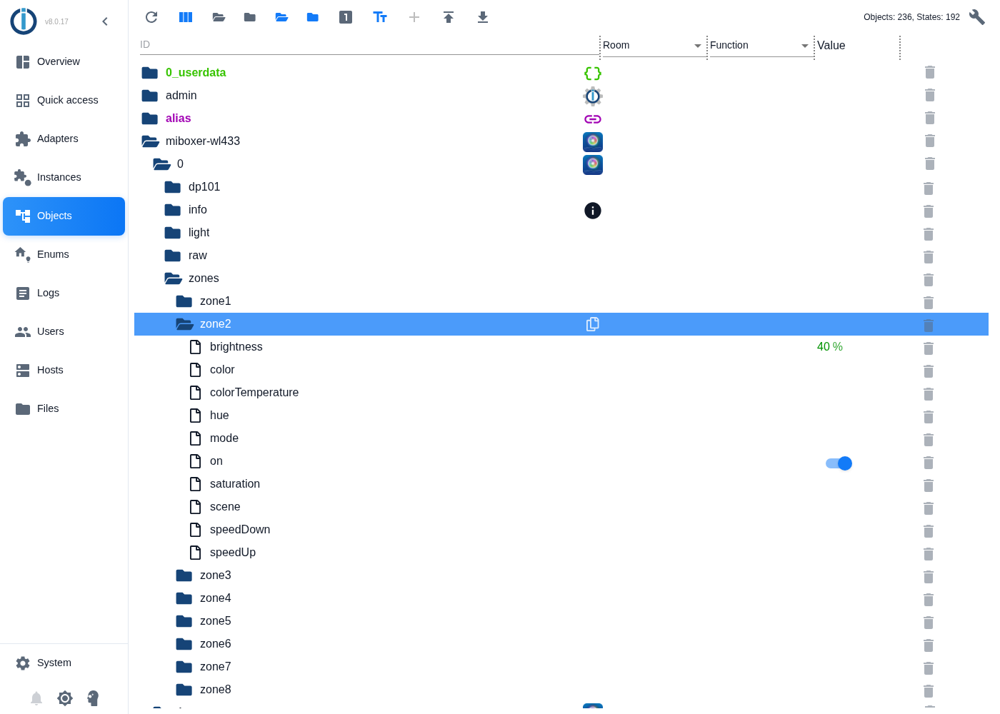

> [!NOTE]
> A zone channel shows the values **last sent to this zone and confirmed by the gateway**. Fields stay empty until you have sent something to the zone. In the picture, only "on" and "brightness 40 %" were sent to zone 2. A command via `light.*` (all zones) enters its value in all eight zone channels.

## 11. Timers

The adapter can switch the pool lights by itself – at fixed times or depending on the sun. You set up to **50 timers** in the settings of the instance, completely without programming. The timers run in ioBroker in your home and also work when the internet is down.

### 11.1 Timers of the adapter or timers of the app?

The MiBoxer app has timers as well. Both kinds work independently of each other:

| | Timers of the adapter | Timers of the MiBoxer app |
| --- | --- | --- |
| Where they are stored and run | in ioBroker, in your home | in the Tuya cloud on the internet |
| Without internet | work | do not work |
| Trigger | fixed time or sun event (e.g. sunset), each with an offset in minutes | fixed time |
| Random shift (presence simulation) | yes | no |
| Days | weekdays and season (e.g. only 1 May to 30 September) | weekdays |
| Zones | all zones or one particular zone | all zones |
| Actions | switch on, switch off, white light, colour, colour programme, brightness and switching off again after a duration | switch on or switch off |

The information about the app timers comes from a test with the app on 2026-09-22.

> [!NOTE]
> The adapter can neither show nor change the timers of the app. But when an app timer switches the lamps, the adapter sees the result at once and updates `light.*`. You can use both kinds at the same time – just make sure that they do not contradict each other (for example app timer "on at 8:00 pm" and adapter timer "off at 7:55 pm").

### 11.2 Preparation: location for sun events

This step is only needed if a timer shall follow a sun event (sunrise, sunset, dusk …). The adapter calculates these times from the location of your ioBroker installation. Usually it is already set. This is how you check it:

1. In ioBroker Admin click **System** at the bottom left. The window **Base settings** opens.
2. On the tab **System** you find **Latitude** and **Longitude** on the right below the map (marked in red). If the numbers roughly match where you live, everything is fine.
3. Otherwise enter the values. You can find them, for example, by searching for your town in a map service. Example London: latitude `51.51`, longitude `-0.13`. Use a **dot** as decimal separator.
4. Click **Save and close**.
5. Restart the instance **miboxer-wl433.0** (on the left **Instances**, in its row click the symbol with the circular arrow). Only then the adapter takes over the new location.

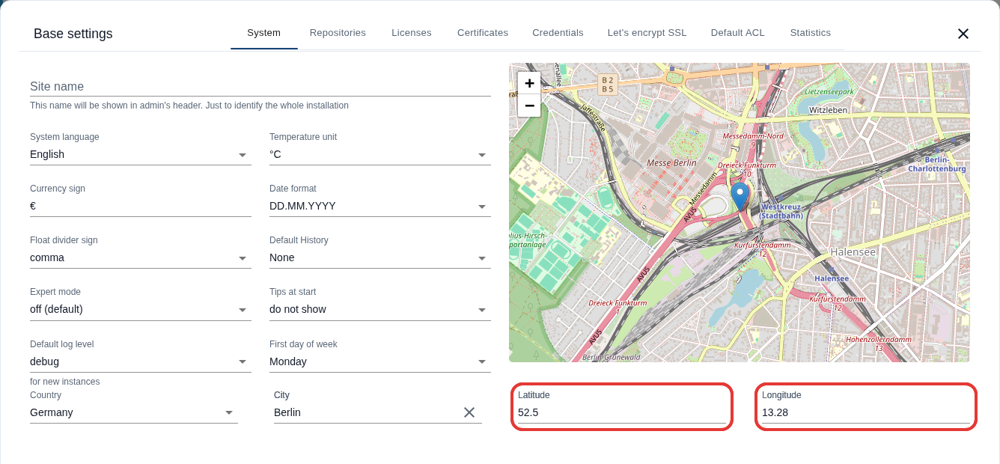

> [!NOTE]
> Without a location, the adapter ignores timers with a sun event and writes a warning to the log. Timers with a fixed time do not need a location.

### 11.3 Creating a timer – step by step

1. Click **Instances** on the left and, in the row **miboxer-wl433.0**, the **spanner symbol** (as in chapter 7).
2. Click the tab **Timers** at the top.
3. Click the **+** (plus, marked in red). A new entry appears and is already open. It is preset so that it switches on all zones every day at 8:00 pm (20:00):

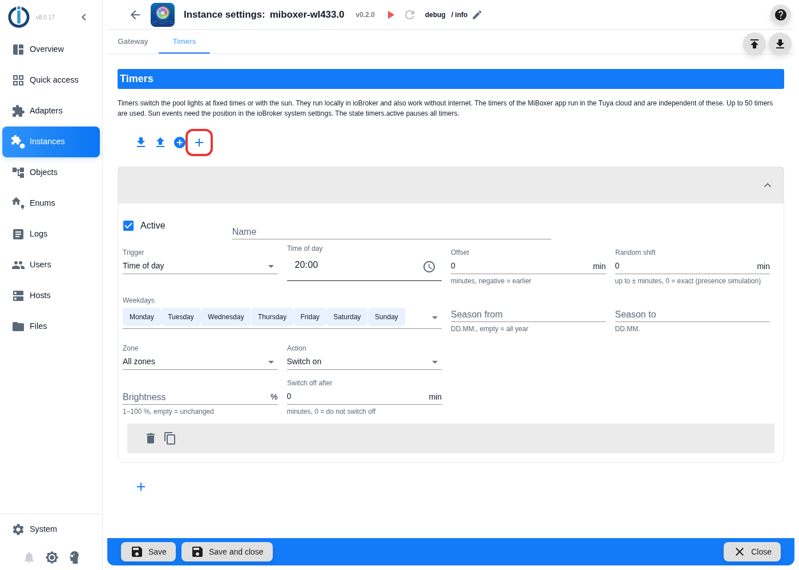

4. Enter a short name at **Name**, for example `Pool evening`. The name appears in the header of the entry and in the log.
5. Choose the **Trigger**: *Time of day* or a sun event (table in 11.4). For *Time of day* click the clock symbol in the field **Time of day** and choose the time.
6. Choose the **Weekdays**: click the field, a list opens. A click on a day selects or deselects it. A click next to the list closes it again.
7. Set **Zone** and **Action**. Depending on the action, further fields appear: **Colour temperature** for *White light*, **Colour** for *Colour*, **Scene** for *Scene*.
8. Click **Save and close** at the bottom. The instance restarts and schedules the timer.
9. **Check:** on the **Objects** tab the state `miboxer-wl433.0.timers.nextRun` shows when the next timer switches (11.7).

> [!TIP]
> Create similar timers with the copy symbol (11.6) – then you only have to change the differences.

### 11.4 The fields in detail

| Field | Meaning | Example |
| --- | --- | --- |
| **Active** | Removing the tick switches the timer off without deleting it | ticked |
| **Name** | Any name you like | `Pool evening` |
| **Trigger** | *Time of day* or a sun event (table below) | *Sunset* |
| **Time of day** | Only for the trigger *Time of day*: when the timer switches | `21:30` |
| **Offset** | This many minutes earlier (negative number) or later (positive number) than the trigger, from −720 to 720 | `-15` = 15 minutes before sunset |
| **Random shift** | Each time, the timer switches randomly up to this many minutes earlier or later (0 to 120). This makes it look as if someone were at home | `10` = between 10 minutes earlier and 10 minutes later |
| **Weekdays** | The days on which the timer switches | Monday to Friday |
| **Season from / Season to** | Only in this period of the year, in the format `DD.MM.`. A season across the new year is possible (`01.11.` to `28.02.`). Both fields empty = all year | `01.05.` to `30.09.` |
| **Zone** | *All zones* or one zone from 1 to 8 | *All zones* |
| **Action** | What happens (table below) | *White light* |
| **Colour temperature** | Only for *White light*: 2700 K (warm) to 6500 K (cold) | `3000` |
| **Colour** | Only for *Colour*: colour from the colour picker | blue |
| **Scene** | Only for *Scene*: colour programme M1 to M9 | M3 |
| **Brightness** | 1 to 100 %. Leave it empty = the brightness stays as it is. Not for *Switch off* | `60` |
| **Switch off after** | After this many minutes the timer switches the lamps of its zone off again (0 = do not switch off, at most 1440 = 24 hours). Not for *Switch off* | `120` |

**The sun events:**

| Trigger | When |
| --- | --- |
| *Dawn* | It gets light: start of the civil morning twilight (sun 6° below the horizon) |
| *Sunrise* | The sun appears on the horizon |
| *Golden hour (evening)* | Start of the "golden hour", about one hour before sunset (sun 6° above the horizon) |
| *Sunset* | The sun disappears behind the horizon |
| *Dusk* | It is almost dark: end of the civil evening twilight (sun 6° below the horizon) |
| *Night* | It is completely dark: start of the astronomical night (sun 18° below the horizon) |

Example Berlin on 21 June: dawn 03:52, sunrise 04:43, golden hour 20:37, sunset 21:33, dusk 22:23. On 21 December: sunrise 08:14, sunset 15:53.

> [!IMPORTANT]
> In Germany (and further north) it never gets completely dark from about mid-May to the end of July – the *Night* does not happen then, and a timer with this trigger does not switch on these days. For the summer, better use *Dusk* with an offset.

**The actions:**

| Action | What happens |
| --- | --- |
| *Switch on* | Switches the lamps on with the values set last |
| *Switch off* | Switches the lamps off |
| *White light* | White light with the chosen colour temperature |
| *Colour* | The chosen colour |
| *Scene* | Starts the chosen colour programme M1 to M9 |
| *Brightness only* | Changes only the brightness – for this the field **Brightness** must contain a value |

If the lamps are off, *White light*, *Colour*, *Scene* and *Brightness only* switch them on first – just like the app.

### 11.5 Examples

**Example 1 – warm white light every evening in summer**

| Field | Value |
| --- | --- |
| Name | `Pool evening` |
| Trigger | *Sunset*, offset `-15` |
| Weekdays | all |
| Season | `01.05.` to `30.09.` |
| Zone | *All zones* |
| Action | *White light*, colour temperature `3000`, brightness `60` |

Result: from May to September the adapter switches on warm white light at 60 % brightness every evening 15 minutes before sunset.

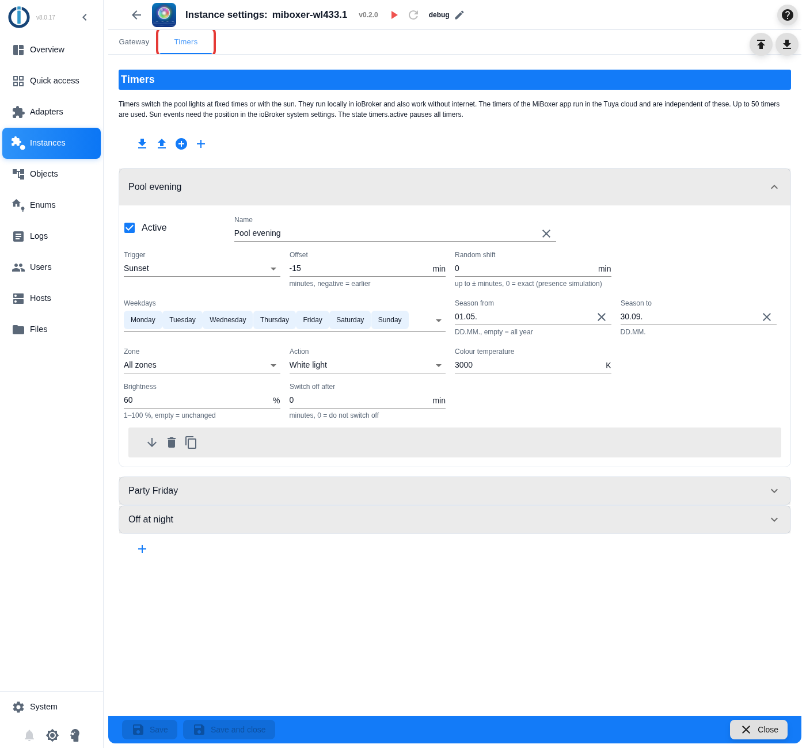

**Example 2 – colour programme for two hours at the weekend**

| Field | Value |
| --- | --- |
| Name | `Party Friday` |
| Trigger | *Time of day* `21:30` |
| Weekdays | Friday, Saturday |
| Zone | *Zone 2* |
| Action | *Scene* M3, switch off after `120` |

Result: on Fridays and Saturdays at 9:30 pm (21:30) the colour programme M3 starts in zone 2. At 11:30 pm (23:30) the adapter switches zone 2 off again.

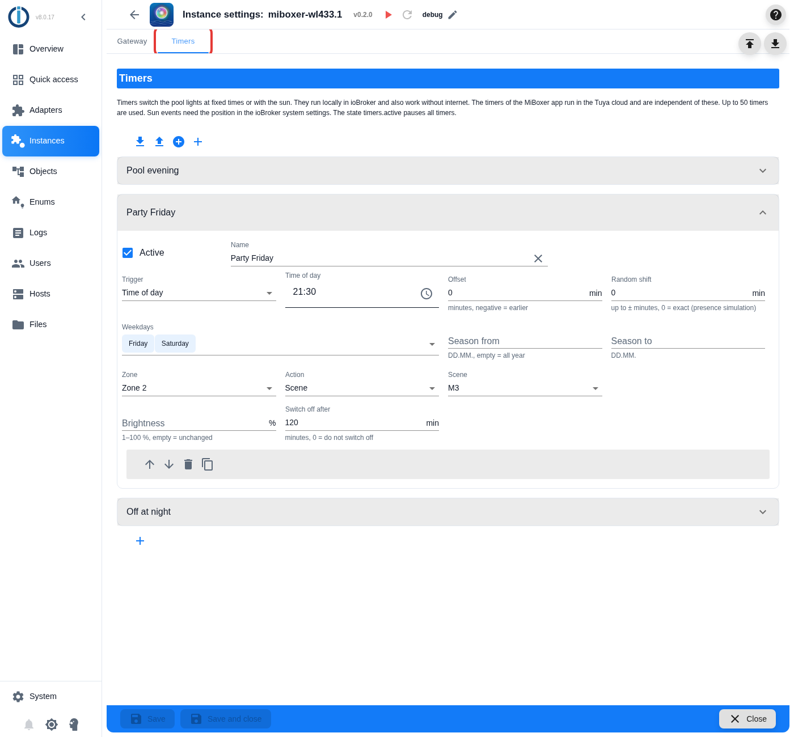

**Example 3 – switching off at night as if by hand**

| Field | Value |
| --- | --- |
| Name | `Off at night` |
| Trigger | *Time of day* `23:30`, random shift `10` |
| Weekdays | all |
| Zone | *All zones* |
| Action | *Switch off* |

Result: every night all lamps go off between 11:20 pm and 11:40 pm – each day at a slightly different time.

> [!TIP]
> Example 3 is also a good safety net: the automatic "switch off after" of example 2 is lost if the instance restarts in the meantime (11.8). A timer of its own for switching off still switches.

### 11.6 Changing, copying, moving and deleting timers

- **Change:** click the header of an entry (the name) to open or close it, and change the fields.
- In the grey bar at the bottom of every open entry you find these symbols:

| Symbol | Effect |
| --- | --- |
| Arrow up / down | Move the entry up or down in the list. The order only determines the number of the timer in the log |
| Waste bin | Delete the entry |
| Two sheets | Copy the entry – handy for similar timers |

- **After every change** click **Save and close**. Only then the changes apply. With **Close** without saving you discard them.
- The settings page allows at most **50 timers**.
- Above the list there are symbols to save all timers to a file (**Export configuration section**) and to load them from a file (**Import and replace configuration section** or **Import and add configuration section**). This way you can back up your timers or transfer them to another instance. **(unverified)**

### 11.7 Keeping an eye on the timers and pausing them

On the **Objects** tab you find these states under **miboxer-wl433 → 0 → timers**:

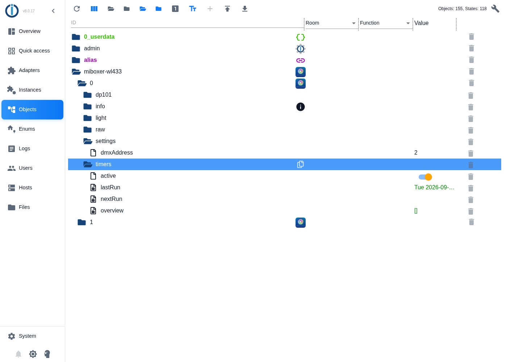

| State | Meaning |
| --- | --- |
| `timers.active` | Switch for **all** timers: `false` pauses them (for example during holidays or in winter), `true` runs them again. Runs that fall into the pause are skipped, not made up for |
| `timers.nextRun` | The next run with its name, for example `Tue 2026-09-22 19:05:00 · Pool evening`. During the pause it starts with `paused` |
| `timers.lastRun` | The last run with name and action |
| `timers.overview` | List of all timers with schedule, action, next run and – if a timer is ignored – the reason (`error`) |

> [!TIP]
> `timers.active` can also be switched from scripts, visualisations or voice assistants – see the example in chapter 12.1.

### 11.8 Good to know

- **Time:** the time of the ioBroker computer applies. Daylight saving time is taken into account.
- **Gateway not connected:** if the gateway cannot be reached when a timer is due, this run is skipped. The adapter writes a warning to the log and does not make up for the run.
- **Restart:** every time the settings are saved, the instance restarts and schedules all timers again. A running "switch off after" is lost.
- **Weekdays and offset:** weekdays and season refer to the day of the trigger. A timer "time of day 00:30, offset −60, Saturday only" therefore switches on Friday at 23:30.
- **Zones:** with the variant *zone selector*, timers send to their own zone without changing `light.zone`. With *one channel per zone* they update the channel of their zone (`zones.zone1` to `zones.zone8`).
- **Confirmation:** like every other command, each timer command is confirmed by the gateway (chapter 9.4).

### 11.9 When a timer does not switch

Go through these points in order:

1. Is the tick **Active** set for the timer, and did you click **Save and close**?
2. Is `timers.active` set to `true`?
3. Is the timer listed in `timers.overview` with an `error`? Then the entry names the reason:

| Reason | Meaning | Remedy |
| --- | --- | --- |
| `no valid time set` | No time entered | Choose a time |
| `no weekday selected` | No weekday selected | Select at least one day |
| `season needs "from" and "to" as DD.MM.` | Only one of the season fields filled in, or wrong format | Fill in both fields in the format `DD.MM.` or empty both |
| `action white needs a colour temperature` | *White light* without colour temperature | Enter a colour temperature |
| `action colour needs a colour like #0000ff` | *Colour* without a valid colour | Choose a colour |
| `action scene needs a scene 1 to 9` | *Scene* without a scene | Choose a scene |
| `action brightness needs a brightness` | *Brightness only* without brightness | Enter a brightness |
| `uses the sun event "…", but no position is set …` | The location for the sun event is missing | Set the location (11.2) |

4. Does the timer have a next run at all? If its `nextRun` is `null`, weekdays, season and trigger never fit together (for example *Night* only in June).
5. Was the gateway connected at the planned time? Then the log shows `[timer] … could not switch the lights …`.
6. Set the log level to `debug` (chapter 13.1). The adapter then writes with the tag `[timer]` for every timer when it runs next and why.

## 12. Automation examples

> [!TIP]
> You do not need a script for switching times: the timers from chapter 11 do this more easily. Scripts are worthwhile if the lights shall react to other things – for example to a motion detector or the pool cover.

### 12.1 With scripts (JavaScript adapter)

For this, install the adapter **JavaScript/Blockly** (**Adapters** tab, search `javascript`). Create a new JavaScript under **Scripts** and insert:

```javascript
// At sunset: switch the pool lights on in blue at 60 % brightness
schedule({ astro: "sunset" }, async () => {
    await setStateAsync("miboxer-wl433.0.light.color", "#0000ff");
    await setStateAsync("miboxer-wl433.0.light.brightness", 60);
});

// Switch off at 11 pm
schedule("0 23 * * *", async () => {
    await setStateAsync("miboxer-wl433.0.light.on", false);
});
```

**Switch only one zone – variant "zone selector":**

```javascript
// Zone 2 to colour programme M3, then address all zones again
await setStateAsync("miboxer-wl433.0.light.zone", 2);
await setStateAsync("miboxer-wl433.0.light.scene", 3);
await setStateAsync("miboxer-wl433.0.light.zone", 0);
```

**Switch only one zone – variant "one channel per zone":**

```javascript
await setStateAsync("miboxer-wl433.0.zones.zone2.scene", 3);
```

**Pause all timers while the pool cover is closed** (adapt the state of the cover to your installation):

```javascript
on({ id: "0_userdata.0.poolCoverClosed", change: "ne" }, obj => {
    setState("miboxer-wl433.0.timers.active", !obj.state.val);
});
```

### 12.2 With Blockly (without programming)

Blockly is part of the **JavaScript/Blockly** adapter. You put building blocks together: **(unverified)**

1. Create a new **Blockly** script under **Scripts**.
2. Choose a trigger from the group **Timeouts / schedule**, for example **Astro** with *sunset*.
3. Drag the block **control** from the group **System**, select the object ID `miboxer-wl433.0.light.color` and enter `#0000ff` as the value.
4. Save and start the script.

### 12.3 Visualisation and voice assistants

The states have the "roles" common in ioBroker (for example *light switch*, *dimmer*, *colour RGB*, *colour temperature*). Visualisations and adapters for voice assistants can therefore usually recognise the pool lights automatically as a lamp. **(unverified)**

## 13. Troubleshooting

### 13.1 Switching on the detailed log

For troubleshooting, the adapter can write every step to the log:

1. Open the settings of the instance (chapter 7, spanner).
2. At the top, next to the name, you see the **log level** (for example `info`). Click the **pencil** next to it and choose `debug`.
3. You can also find the pencil in the picture in chapter 7 at the top, right of *v0.2.0*.

You see the log on the left under **Logs**. Type `miboxer` into the filter field at the top to see only the messages of this adapter. Every message starts with a tag in square brackets, for example `[conn]` for the connection or `[cmd]` for commands.

> [!TIP]
> Set the level back to `info` after troubleshooting. The level `debug` produces a lot of lines.

### 13.2 Messages and what you can do

| Message in the log (beginning) | Meaning | What you can do |
| --- | --- | --- |
| `[cfg] Adapter is not configured: please enter the device ID and the local key …` | Device ID or local key are missing | Chapter 7: fill in both fields |
| `[cfg] The local key must have exactly 16 characters …` | The local key is too short or too long | Copy the key exactly (16 characters, no spaces) |
| `[conn] Cannot keep a connection to the WL-433 gateway …` | The gateway does not let the adapter in | Check IP address, local key and protocol version; close the MiBoxer app on all phones; switch off other Tuya integrations (ioBroker.tuya, Home Assistant) for this gateway |
| `[rx] Gateway sent data that could not be decoded …` | The local key is wrong or outdated (gateway paired again) | Repeat chapter 5 and enter the new local key |
| `[disc] Gateway … did not announce itself in the local network …` | The automatic search did not find the gateway | Read the IP address from the router and enter it; gateway and ioBroker must be in the same network |
| `[cmd] #12 light.brightness: the gateway did not confirm …` | After a command, the gateway did not report a matching state | Is the gateway switched on and in the WiFi? Check in the app whether it is reachable. If it happens often: report a problem (13.4) |
| `[poll] … Status query not answered …` | The gateway does not answer the state query | Check that it really is a WL-433; report a problem (13.4) |
| `[cmd] … not executed: a colour like "#ff8800" is expected` | The value entered has the wrong format | Enter the colour in the format `#RRGGBB` |
| `[cmd] … not executed: gateway is not connected` | The command came while there was no connection | Wait until `info.connection` is `true` again and repeat the command |
| `[dp101] Status frame … has an unknown mode …` | The gateway reports an unknown state | Report a problem (13.4) |
| `[cfg] light.mode is created again without the mode "music" …` | One-time change when updating from version 0.0.1 | Nothing – set custom settings of this state (e.g. history) again if needed |
| `[cfg] Zone mode "…": removed …` | After changing the zone control, the states of the other variant were deleted | Nothing – adapt scripts if needed |
| `[timer] Timer 3 "…" is ignored: …` | The timer is set up incompletely; the reason follows the colon | Correct the timer on the tab **Timers** (11.9) |
| `[timer] Timer … uses the sun event "…", but no position is set …` | The location for sun events is missing | Set the location and restart the instance (11.2) |
| `[timer] Timer … has no run within the next year …` | Weekdays, season and trigger never fit together | Check weekdays, season and trigger (11.9) |
| `[timer] #… Timer … could not switch the lights: gateway is not connected` | The gateway was not connected when the timer was due; this run is skipped | Check the connection (chapter 8) |
| `[timer] … timers configured, only the first 50 are used …` | More than 50 timers are stored (for example after an import) | Delete the surplus timers |
| `[cmd] #… settings.dmxAddress: the gateway did not confirm the DMX start address …` | The gateway did not confirm the new DMX start address | Check the connection and write the value again (9.5) |

### 13.3 Frequently asked questions

**All zones show the same colour, although the lamps shine differently.**
That is correct: the gateway reports only one state for all lamps (chapter 10).

**A value jumps back briefly after changing it or is only taken over after 2 to 3 seconds.**
The gateway reports its state about 2.5 seconds after the last change. Only then the adapter takes over the value for good.

**After pairing the gateway again in the app, nothing works any more.**
The local key has changed. Read it again (chapter 5) and enter it (chapter 7).

**The IP address of the gateway has changed.**
Leave the field **IP address of the gateway** empty – then the adapter searches the gateway itself. Even better: set up a DHCP reservation in the router (chapter 3).

**The speed of the colour programme is not shown anywhere.**
The gateway does not report it. `speedUp` and `speedDown` still work.

**The adapter reports success, but a lamp does not react.**
The adapter only sees the gateway, not the lamps. Check whether the lamp is linked to a zone and whether it reacts in the app. Lamps under water have a shorter radio range.

**I created timers in the MiBoxer app. Why does the adapter not see them?**
The timers of the app are stored in the Tuya cloud, not in the gateway. The adapter cannot read them, but it sees when they switch (chapter 11.1).

**A timer did not switch.**
Go through the list in chapter 11.9.

**My timer switches at a different time every day.**
That is correct if it follows a sun event – which moves in the course of the year – or if a random shift is set.

**How do I pause all timers, for example during holidays?**
Set `timers.active` to `false`. With `true` they run again (chapter 11.7).

### 13.4 Reporting a problem

Open an "issue" on GitHub: <https://github.com/ssbingo/ioBroker.miboxer-wl433/issues>. Helpful are:

1. the adapter version (shown at the top of the instance settings, e.g. *v0.2.0*);
2. a log at level **debug** – from the start of the instance to the error (13.1);
3. the content of the state `dp101.history` (click it on the Objects tab under `miboxer-wl433.0.dp101` and copy it);
4. a short description of what you did and what happened.

> [!NOTE]
> The adapter **never** writes the local key to the log – the log only shows its length. So you can attach the log without worry. But do **not** attach recordings of the MiBoxer app (chapter 5), because they contain the key.

## 14. For the curious: how it works in detail

This chapter is for everyone who wants to understand or rebuild how the adapter talks to the gateway. You do not need it for operation.

### 14.1 The connection

The WL-433 contains a WiFi module made by Tuya. The adapter connects to the gateway with the **Tuya LAN protocol 3.3** (TCP port 6668, encrypted with the local key). The actual light, zone and scene commands are in the vendor specific **datapoint 101**: short messages ("frames") of 12 bytes. The last byte is a checksum – the sum of the first 11 bytes.

### 14.2 The commands

A command to the gateway looks like this (values in hexadecimal notation):

```text
41 00 00 0B  cc  vv  vv vv vv  zz  80  ss
             │   │             │       └─ checksum
             │   │             └─ zone: 00 = all, 01–08 = zone 1–8
             │   └─ value
             └─ command
```

| Command `cc` | Meaning | Value `vv` |
| --- | --- | --- |
| `01` | hue (switches to colour) | 0–255 for the whole colour wheel, in bytes 5 to 8 |
| `02` | brightness | 1–100 % |
| `03` | colour temperature | 0–38 (2700 K + 100 K per step) |
| `04` | saturation | 0–100 % |
| `05` | colour programme | 1–9 (M1–M9) |
| `06` | key | `01` on, `02` off, `03` slower (S-), `04` faster (S+), `06` white light. `05` switches off as well (a second time the lamps stay off); what this key does differently from `02` is still unknown – the adapter does not use it |

The gateway answers the query `43 00 00 80 00 00 00 00 00 80 80 C3` with its state:

```text
42|44 00 00 00  mm  hh  tt  bb  ss  0B  dd  xx
                │   │   │   │   │       └─ DMX start address (low byte)
                │   │   │   │   └─ saturation (0 in white mode)
                │   │   │   └─ brightness
                │   │   └─ colour temperature step
                │   └─ hue
                └─ mode: 00 off, 01 colour, 02 white, 03–0B programme M1–M9
```

`42` reports a change (about 2.5 seconds after the last change), `44` is the answer to the query.

The DMX start address (chapter 9.5) has a command of its own:

```text
49 00 00 0B 02  aa aa  00 00  zz  80  ss
                │             │       └─ checksum
                │             └─ zone: 00 = all, 01–08 = zone 1–8
                └─ DMX start address 1–512 (high byte, low byte)
```

The gateway answers with `49 00 00 0B 02 01 tt bb ss aa aa xx`: `01` = accepted, followed by colour temperature step, brightness, saturation and the address.

### 14.3 The timers of the MiBoxer app

The app stores its timers via the Tuya cloud (interface `tuya.m.timer.group.add`, category `mi-light-timer`). A timer consists of a time, the weekdays (`loops`, for example `0111000` = Monday to Wednesday, starting with Sunday) and a command such as `{"dps":{"20":true}}`. So it writes the standard datapoint 20 (on/off), without zone and without datapoint 101. At the planned time the cloud sends the command to the gateway; the adapter then sees datapoint 20 and about 2.5 seconds later the new status. These timers cannot be read locally.

### 14.4 Reproducing the protocol yourself

The format was decoded like this on 2026-09-22 – you can check it with the same method or extend it for a newer gateway firmware:

1. **Read the commands of the app:** connect an Android device to the computer as in chapter 5.1 and start `adb logcat -v time > commands.txt`. The MiBoxer app writes every command as a line `ayxsendData =<hex values>` to the log.
2. **Exactly one action per step:** carry out exactly **one** action in the app (for example "brightness to 50 %"), write down the time and wait about 10 seconds until the next action.
3. **Find the commands:** `findstr "ayxsendData" commands.txt` (Windows) or `grep ayxsendData commands.txt` (Linux, macOS) lists all commands sent.
4. **Compare the states:** the state `dp101.history` of the adapter shows the matching state reports of the gateway with their time.
5. **Send yourself:** in `dp101.hex` you can enter 11 bytes – the adapter adds the checksum and sends the frame. Example: `43 00 00 80 00 00 00 00 00 80 80` asks for the state.

> [!WARNING]
> The file `commands.txt` also contains the local key. Do not publish it – publish only the `ayxsendData` lines you picked out.

The complete derivation with all evidence is in the protocol analysis (German), chapters 3.1.8 and 3.1.9: [Miboxer_WL-433_PW01_Protokollanalyse_lokale_Steuerung.md](Miboxer_WL-433_PW01_Protokollanalyse_lokale_Steuerung.md).

## 15. Glossary

| Term | Explanation |
| --- | --- |
| **Adapter** | An add-on program for ioBroker that connects a certain device or service |
| **Instance** | A running adapter with its own settings, e.g. `miboxer-wl433.0` |
| **State** | A single value in ioBroker, e.g. `light.brightness`. Visible on the **Objects** tab |
| **Acknowledged (ack)** | The value was reported or confirmed by the device – not just entered |
| **Gateway** | The WL-433 device that mediates between WiFi and radio |
| **Zone** | A group of lamps that are switched together (1 to 8) |
| **Scene / colour programme** | The programmes M1–M9 of the app with changing colours |
| **Device ID** | The unique identifier of the gateway at Tuya |
| **Local key** | The secret 16-character key for the encrypted connection in the home network |
| **Tuya** | Manufacturer of the WiFi module in the gateway and of the related cloud |
| **LoRa** | The radio technology the gateway uses to reach the lamps (433 MHz) |
| **Log** | A diary in which a program writes what it does |
| **adb** | A tool from Google that lets a computer access an Android device |
| **DHCP reservation** | A router setting that always gives a device the same IP address |
| **Timer** | A switching time: switches the lamps at a certain time |
| **Sun event** | A point in time that depends on the position of the sun, for example sunset. It moves in the course of the year |
| **Twilight (dawn, dusk)** | The time between day and night when it is still (evening) or already (morning) somewhat light |
| **Season** | A period of the year, for example 1 May to 30 September |
| **Presence simulation** | Lights that switch at slightly different times every day, so that the house looks inhabited |
| **DMX** | A standard for controlling stage and effect lighting by cable. Every device reads a fixed number of channels from its start address (1 to 512) on |
| **JSON** | A text format for structured data, for example in `timers.overview` |

## 16. Legal notice and contact

This is an **unofficial community project**. It is not affiliated with Shenzhen Futlight Optoelectronics Co., Ltd. (MiBoxer / Mi-Light) or Tuya. "MiBoxer", "Mi-Light" and "Tuya" are trademarks of their respective owners and are only used to describe compatibility. Use at your own risk.

- Source code and questions: <https://github.com/ssbingo/ioBroker.miboxer-wl433>
- License: MIT – Copyright (c) 2026 ssbingo
